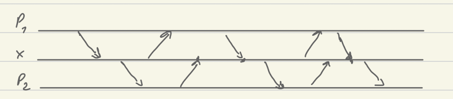

# Distr-synt-snapshot-nov21

## Summary
- There is a mind-map of this in Works/Corto
- Most interesting is probably model with semaphores. This is where restricting
  a skeleton makes sense.
- For shared variable model, it would be good to know that it is undecidable
  with 2 vars. Maybe it is decidable with 1 var (here skeleton is not fixed)

## German-Sistla model  
  
* RDV on a, \bar a actions. All identical processes.  
* Reachability is by saturation argument  
* For infinite paths, argument uses flow equation  
  
## Shared variables causal memory  
  
* This has not been looked much  
* More difficult than RDV as causal memory gets assymmetric.  
* Q: Can we show decidability for fixed negotiation?  
	* What is a fixed comm pattern?  
	* We can say that every process does (RW)*. But then there is a scheduling which prevents P1 to learn anything about P2  
	   

* Is this case decidable for one shared variable? For two?  
	* Two variables would cover Patterson.  
	* Here we do not assume that skeleton is fixed in any way.  
  
## ZA, symmetric RDV  
  
* Information flows both ways  
* Decidable for fixed (undetermined) skeleton  
	* The algorithm is Tower, but we do not have even exponential lower bound for fixed number of processes.  
* Decidable for sound det negotiation fixed in advance.  
* What about the case with resource nodes: there communication pattern is not fixed, but they are totally deterministic.  
	* Show undecidability if comm patterns for processes are not fixed.  
	* We may have regular (deterministic) patterns for communication of each process.  
  
## assymetric RDV  
  
* Information flows one way  
* Is send blocking?  
  
## 1-place buffer  
  
* This is different from variable as communication is always one way.  
* Send is not blocking: it just erases previous content  
* Q: Is this model good enough for Dining Philosophers?  
  
## Some semaphore thing  
  
* This may be more interesting for fixed skeleton  
* If we just to read, and see that we have done it too early because there is still old value there, then fixed skeleton is doomed.  
* On the other hand if we have an interrupt when value has changed, then we can hope that fixed skeleton model makes sense.  
  
## Synthesizing dining philosophers  
  
* Processes have grab and release for forks.  
* We can assume that with each release process leaves its current snapshot in the semaphore. With every grab it takes the snapshot of the last process that has done release.  
* Q: what it means fixed skeleton/negotiation in this case?  
