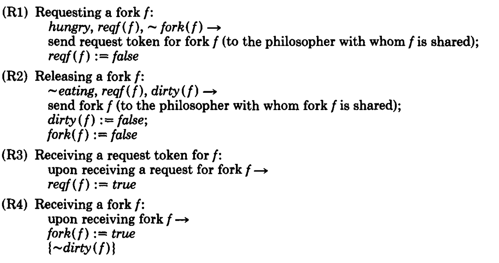

# Drinking philosophers

Chandra and Misra "Drinking Philosophers" ACM Transactions on Programming
Languages and Systems, Vol. 6, No. 4, October 1984
[chandy-misra-drinking-pliosophers.pdf]

The setting is that there are channels between processe through which processes
send messages. 
There is no assumption on a delay when a message is delivered.
A program is one guarded command repeated forever. 
In the guards we have conditions what to do when receiving something. 
Send actions are on the right hand-side of the conditional.
It is not clear what fairness assumption they use. Surely they require that
eating takes finite time, but they should also say something about precedence of
sending a fork before getting to eat again. Eating only with clean forks is not
a good solution because it would block if only one philospher wants to eat.

This is an example of a solution where we processes do not always know with whom
they communicate next.

We have processes P1,..,Pn and resources R1,..,Rk
Every resource is needed by 2 processes.
There is no assumption on speed of the processes. 
At its turn process executes all its rules and then it eventually executes on of
the change state rules. 

(Initialization) Give resource to lower id process. Make it dirty

Rules:
1) When Pi wants a resource he sends a request to the other process that needs
   this resource (this is the only one that can have it)
2) On receiving a request for Rj, the process sends it if it is dirty (cleaning
   it before), and keeps it if it is clean
3) After using resources, all resources become dirty. If there are pending
   requests for the resources, they are sent (and cleaned before sending).

  

State changes:
- hungry, and has all resources -> eating
- eating -> thinking
- thinking -> hungry

I imagine that the assumption is that the first state change fires eventually if
it is enabled. Similarly for the second. The third is not necessary to happen.

What we assume that in one turn process can do only one state change, so it
cannot go from eating to thinking to hungry to eating in one round. This
way the other processes get the forks if they requested them 

Here we do not know in what order we will receive resources. 

## Literature
There is a discussion of this paper in: [drinking-philosophers-efficient.pdf]