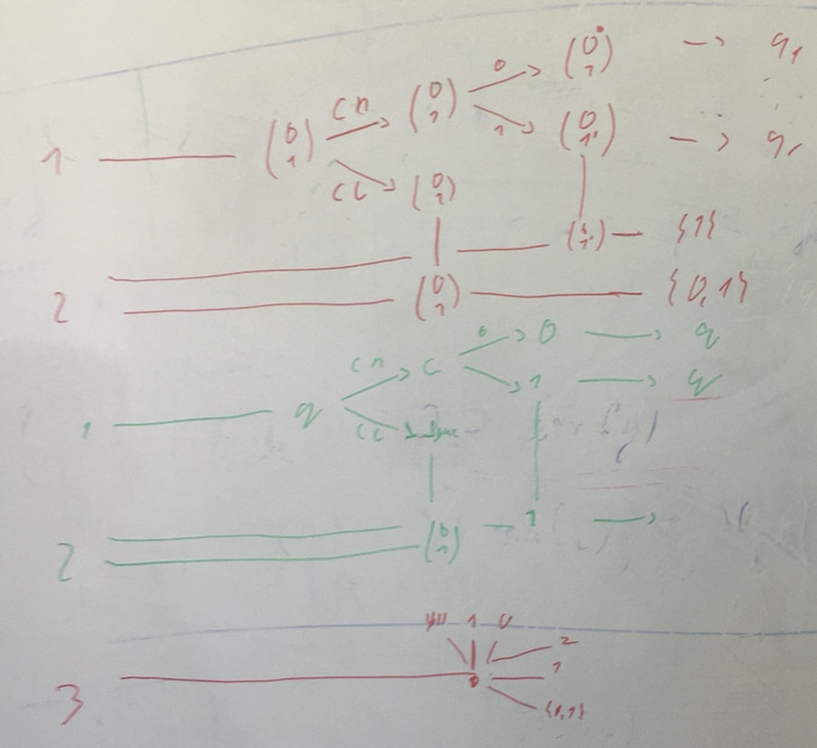

# Fixed skeleton case

The idea is that it suffices to keep the tuples that arrive at each frontier.
Then we can glue two frontiers to which the same tuples arrive.

- As Corto has noticed we need quite a lot of information about frontier. 
  It get non-elementary wrt the number of processes. Here is an exaple that
  suggests that indeed this may be needed/
  
  
  The idea on this picture is that environment decides if it wants to decide on
  the final state of p2 before the last communicaiton with p1 or after. 
	This gives first level of choice tree on p2. 
	Then between p2 and p3 the same thing happens. 
  Situation is asymetric, p3 knows everything. But this is not a problem because
  on the frontier the system sees first processes in order p1,p2,p3,..
#distributed
#corto