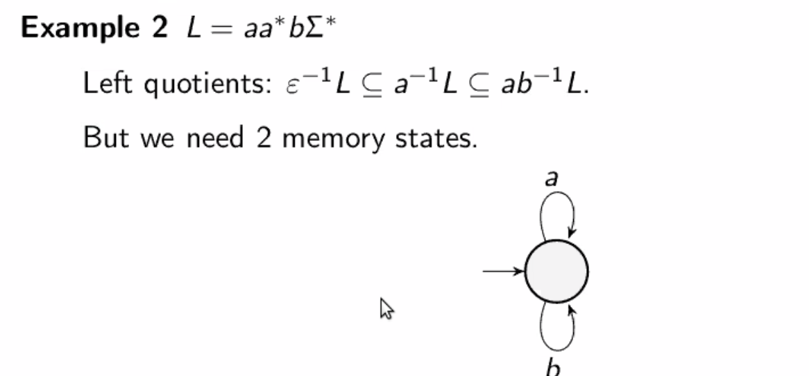

# Good for games

Udi Boker: Good for games automata, Highlights Workshop 26/11/2020

## Definition
There is a strategy to resolve non-determinism by just looking at the past. 
Equivalently: it is good for game, meaning that when we make a product with a
game we get an equivalent game.

Alternating automaton is history deterministic: when both players have
history-deterministic strategy to accept/reject

We can also have half GFG automata where only one of the players has a
history-deterministic strategy.

## Synthesis
It is low complexity for 
* Recurrence/persistance formulas
* GR(1) formulas and some small generalizations

Translate LTL to GFG automata instead of deterministic automata. 
**Challenge** is it possible to get smaller GFG automata than deterministic
automata.

Maybe GFG automata can be better represented?
Maybe they are smaller for some logical fragments?

## Solving parity games
Using deterministic separating automata. But it is enough that they are
good-for-games. 

What about an alternating GFG automaton that can separate the languages?

## Expressiveness
\omega-Automata they are equivalent
Cost automata GFG are more expressive as determinisitc (they are as expressive
as non-deterministic)
\omega-PDA: GFG are more expressive than deterministic and less then
non-deterministic. Universality is decidable [Lehtinen'20]
Timed, limit-average, register: not much known

## Succinctness
* finite words: GFG automaton always embeds deterministic one.
* omega-words: Buchi and co-Buchi may be GFG without deterministic automaton inside
* weak automata: are not more concise
* Buchi automata: it is open if they can be more concise (they are up to quadratically
  more succinct)
* they are exponentially more succinct for co-Buchi
* We do not know for Rabin and Muller if they are more succinct.
* For alternatic omega-automata: single exponential succinctness 
  
## Checking GFG
Given an alternating/nondet automaton, check if it is GFG
For nondeterministic automata:
* It is at least as difficult as solving a game with the same condition.
* Polynomial for Buchi automta (G2 games)
* co-Buchi polynomial. (via G2 games)
* Patity: maybe polynomial for fixed number of priorities
  
For alternating automta
* Weak automata polynomial
* Buchi co-Buchi, parity with fixed number of priorities is <= EXPTIME
  
Logic Formulas to GFG
* Eventually safe mu-calculus [Kuperberg]

Questions:
* where GFG automata are more more expressive than deterministic (for pushdown,
  discounted sum, etc), and stay decidable
* What logics can we compile to small automata (some useful fragments)
* What about translation to half-GFG automata that are sufficient to model-checking.

# Antonio Open Problem
Optimal memory needed to solve generalized reachability games.
We take a language of a finite words L and Eve wants to form a word from L. 

Q: For given language L decide what size of memory we need to win any game with
L as a winning condition.

If L is regular then L<= A_L the deterministic automaton for L.

M_L is at least as big as maximal antichain of left quotients of L. For Adam
this bound is tight, but not for Eve.
  

# Succinctness of pushdown GFG, Martin Zimmermann
What is expressive gain of nondeterministic PDA vs deterministic PDA?
The blowup is more than any computable function [Valiant'76]
What about the same question for GFG-PDA?

# Games for cost functions Thomas Colcombet
Find a good description of winning strategies in "cost games" as memory
We have a regular cost function $f: C^\w \to \Nat\cup\set{\infty}$

Eve plays a natural number and then she wins if every play has a value $\leq n$.
Eventually, we can reduce to games with a number of counters that we can set to 0, or
increase. 
The winning condition is parity + boundedness of counters. 
The current reductions to regular games depend on the size of the initial game.

The intent: solve cost-MSO. But this needs games over infinite arenas.

He is interested in chronological and tree-shaped arenas. There nothing is
known.

# G2-conjecture Kuperberg 
Very interesting read his papers. There is a new one saying that G2 automata
characterize GFG for co-Buchi condition.

#seminar
