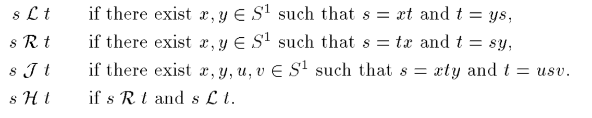

# Green relations

#automta

  

They are defined on elements of a semigroup. They are all equivalence relations
- s L t if one can be obtained from the other by multiplying on the left
- s R t by multiplying on the right
- s H t if both s L t and s R t
- s J t if  one element can be obtained from the other

It is maybe better to look at the pre-order $a\leq_Jb$ when $a=xby$, meaning
that $a$ can be produced from $b$. 
This preorder is a good candidate for induction parameter. 

Similarly one can consider $a\leq_L b$ if $a=xb$, and $a\leq_R b$

Lemma: If $a\leq_L b$ then $ac\leq_L bc$.

Lemma: $R\circ L=L\circ R$.
Proof:
If $aRbLc$ then $a=xcy$ with $b=cy$. 
This also gives $aLdRc$ with $d=xc$.

Lemma [central]: $R\circ L=J$

[colcombet-green-relations.pdf]