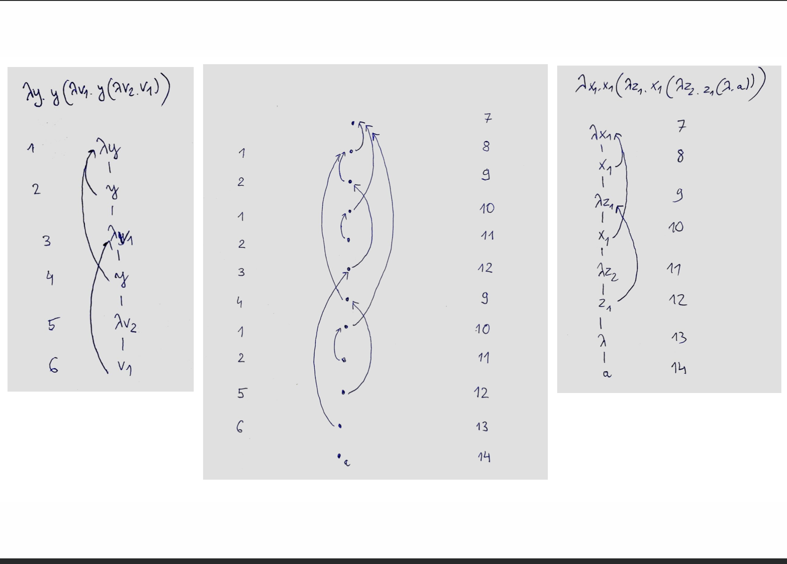

# Higher-order matching

* Literature is in [[higher-order-martching-papers]]

- [[lambda-definability]]
- [[well-quasi-orderings]]
- Maybe alternating visibly pushdown automata on trees can help [[visibly-pushdown-automata]]

Nice simple approach of Parys [[a-reduction-approach-to-homc]]

# TODO
Spisac notatke z Dagstuh z prosta definicja automatu. Z \theta alternacja
Napisac dowod nierozstrzygalnosci tych automatow. 2 liczniki. Uzyc alternacji
aby przekazac stan tak wiec nie automat bedzie monotoniczny.
Zobaczyc gdzie jest miejsce na rozstrzygalnosc.
Jaka jest zlozonosc dla przypadku z 1 atomem?

# 2022-04-11
Jesli bysmy chcieli robic Joly nierozstrzygalnosc na automatach to trzeba isc do
dosyc wysokich typow. 

Saturacja: 
Zlozenie rownolegle wymaga produktu (aby zrobic interleaving)
Byc moze tlumaczenie Algola na automaty moze byc liniowe.
Chcemy miec model ktory autmatycznie generuje ciagi ktore spelniaja saturacje.
Mamy tez nadzieje ze tlumaczenie z automatow do Algola bedzie prostrze
[Plik z overleaf]

# 2022-03-28
Andrzej czytal Joly. Ale jego dowody maja dziury.
Model monotoniczny nad 1-nym elementem moze miec definiowalnosc
nierozstrzygalna.
Jego podejscie jest wykrywanie czy term jest napompowany. 
To robi przez danie specjalnych argumentow termowi.
Zapropragowac OK przy pomocy automatow.

# 2022-03-21
Definiowalnosc na modelami z 2 elementami
Nierozstrzygalnosc gdy jest ustalony typ ale zmienia sie ilosc elementow w modelu
Nierozstrzygalnosc gdy model jest ustalony ale zmienia sie typy.
Typ L : ((o->o)->o) -> (o->o->o)->o ->o

Game semantics on one slide

  

# 2022-03-15
Zrobic przypadek atomowy przy pomocy automatow.
Podprzypadek jest czy typ jest zamieszkaly w teorii intuicjonistycznej
(wystarczy 1 zmienna kazdego typu).
Padovani potrzebuje tylko 2 atomow, ale w profilach wystarczy uzywac 1 stalej,
bo mozemy zalozyc, ze po prawej stronie mamy zawsze ten sam atom.

# 2022-03-02

# 2022-02-16
Harmer nie przechodzi przez automaty bo zapomnielismy o y na samej gorze.
Pytanie: Czy mozna zrobic Padovaniego przez automaty.
Wyglada na to, ze Harmer przechodzi uzywajac argumentu Padovaniego.
Czy mozna udowodnic Hamera automatami?

# 2022-01-24
Monotonicity probably gives decidability for Stirling automata of order 5. 
May it be the case that monotonicity is sufficient condition for decidability?
A hypothesis is that it does not help for order 6.

## 2021-12-01
Comon Jurski []

## [[2021-11-16]]
Dany profil nad jednym atomem sprawdzic czy isntieje term o tym profilu. To
wydaje sie rownowazne pustosci automatow nad postaciami Harmera wiec chyba
roztrzygalne.

## [[2021-23-08]]
Praca Russ Harmer o komorkowych termach. To uzywa niewinnosci.
Trzeba ograniczyc liczbe precinajacych sie lambda, to odpowiada liczbie
otwartych zmiennych. 
Przypadek posredni: jak interpolacja atomowa, ale stale z prawej strony maja
wyzszy typ.
Jak liczba otwartych zmiennych jest widoczna w higher-order pushdown automaton? 
To widac w stanie bo uzywamy zmiennych w stanie, a zmienne moga tez byc
zmiennymi zwiazanymi.
Moze jeszcze lepiej jest uzywac automatu z drzewiastymi stosami z pracy z Lorenzo?

## [[2021-08-02]] Zoom z Andrzejem
* Jest prosty dowód na to ze automaty Stirlinga są nieroztrzygalne. Alternacja w
  jego wersji pozwala na zaznaczanie kazdej lambdy. To sie dzieje dzieki temu,
  ze jego automat bedac w zmiennej, moze spojzec na stan w lambda ktora ja
  wiaze.
* Automaty z jednym rejestrem Marcina i Ranko w pewnwym sensie są bardzo podobne
  ale nie mogą  patrzec na stan automatu w lambdzie. Przez to sa one
  rozstrzygalne. 
* Powinnism spojzec na prostrzy problem fx=a gdzie a jest jedna stala typu 0.
  Rozstrzygalnosc tego problemu jest prostrza, ale moze nam się uda znalezc
  automat ktory opisuje wszystkie rozwiazania. Sa dwie prace na ten temat. 
  Padowani i Clairambault w katalogu [Works/Andrzej/Data Treee Automata]
* [[atomic-higher-order-matching]]

Joly mówi o paru związkach między higher-order matching i problamach
definiwalności.
[joly-loader-undecidability.pdf]
For example HOM for beta instead of beta-eta quality is undecidable. 

* Wydaje sie, ze automaty Stirlinga sa specjalna wersja class automata. Z drugiej
strony latwiej jest pracowac z register automata. Czy nie ma jakies translacji z
jedngo w drugie?
* Profile potrzebne do matching wydaja sie specjalne. 
  Ogolnie pustosc alternujacych automatow Stirlinga jest nierostrzygalna. To
  wynik z zakodowania Loadera. Wydaje sie jednak, ze do matching profile sa
  jakies specjalen
- [ ] Spojzec na dowod Loadera i starac sie zrozumiec roznice.
* (Z jakis powodow unarny PCF jest rozstrzygalny)
- [ ] Zobaczyc dowod Joly nierozstrzygalnosci, jest prostrzy niz Loader
  * [joly-loader-undecidability.pdf] w PDF Expert
- [ ] Barendregt ma przetrawione wyniki Loadera

## Mail Andrzeja
Po naszej rozmowie w poniedziałek odnalazłem pliki z różnymi eksperymentami w Haskellu sprzed lat, gdzie testowałem, jak działa funkcja, która wykrywa, czy dany term typu Monster reprezentuje kolejkę (załączam plik jol.hs).

Funkcja nazywa się “qtest” i polega na zaaplikowaniu termu do sprytnie dobranej funkcji, która w pewnym sensie weryfikuje indukcyjnie, czy dany term ma dobrą strukturę, tzn. 

- każde wiązanie  \f jest użyte dokładnie raz,
- jeśli \f1 pojawia się w termie przed \f2 to aplikacja f1 pojawi się przed aplikacją f2 (FIFO).

Ogólnie, oznacza to, że termy M reprezentujące kolejki można wyłapać za pomocą równania "M f 1 = 1", gdzie f jest odpowiednią funkcją.

Takich termów M można potem użyć do symulacji automatów z kolejką (queue machines) i sprawdzać, czy się zatrzymują, aplikując M do kolejnej “odpowiednio dobranej” funkcji, która zależy od funkcji przejścia automatu.
Wtedy zatrzymanie maszyny można wyrazić przez "M g 0 = 1", gdzie g jest pewną funkcją, która zależy od funkcji przejścia.

Podsumowując, problem stopu dla “queue machines" redukuje się do pytania, czy istnieje term M typu Monster taki, że

M f 1 = 1, 
M g 0 = 1.

Gdyby lambda-definiowalność była rozstrzygalna, można by teraz rozwiązać problem stopu.

Powyższy wywód opiera się na technikach Joly’ego, ale jego dowód wydaje mi się bardziej skomplikowany, bo symuluje maszyny 2-licznikowe termami typu Monster, a do reprezentowania par “dec - inc” używa termów, które mają strukturę kolejki. Skoro i tak używa termów “kolejkowych”, to można ich użyć od razu do symulowania maszyn z kolejką bez przechodzenia przez maszyny z licznikami. Dowód Joly’ego jest za to trochę bardziej ambitny, bo on oba warunki sprawdza naraz i dostaje tylko jedno równanie.

Nie bardzo rozumiem, co z tego wszystkiego wynika dla naszego problemu. Ważną cechą funkcji f i g jest to, że NIE są definiowalne w lambda-rachunku (bo patrzą na argumenty), a w problemie matching wszystko musi być lambda-termem. Nie bardzo wiem, jak to uchwycić za pomocą automatu… Wygląda na to, że powinien mieć ograniczoną możliwość zmiany stanu, żeby nie mógł dokonać ewaluacji dowolnych funkcji skończonych, ale żeby jakoś ciągle mógł sobie poradzić z matching?

Dla pamięci, spisałem poniżej wszystkie pytania, na które warto by znaleźć odpowiedzi z punktu widzenia automatów.

- Dlaczego “higher-order matching” jest rozstrzygalne?
- Dlaczego "unary PCF" jest rozstrzygalne a "binary PCF" nie jest?
- Dlaczego "bot-REACH” ma niewyjaśniony status a “t-REACH” jest nierozstrzygalne?

#Andrzej