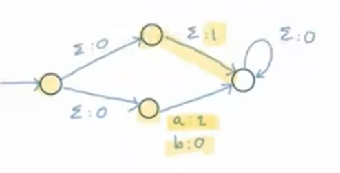
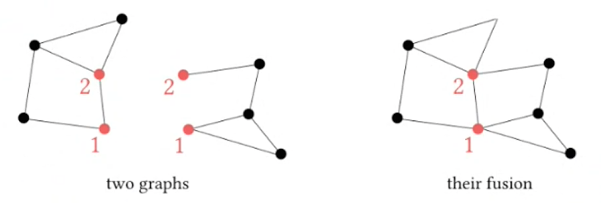
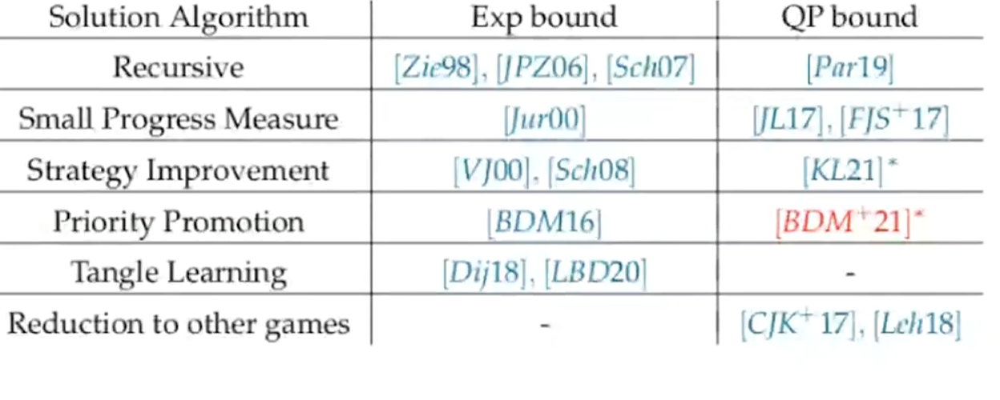
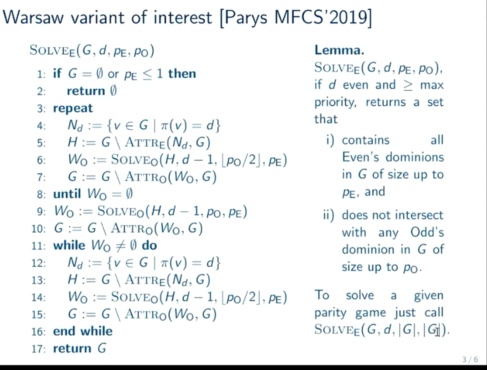
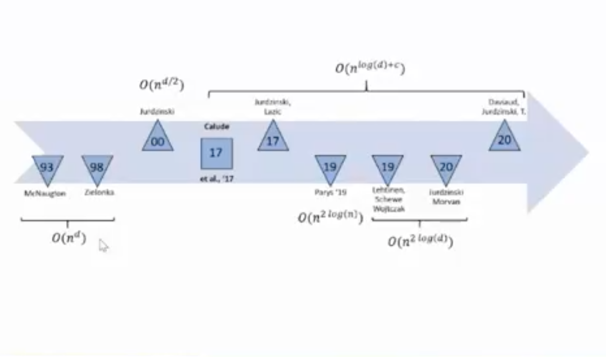
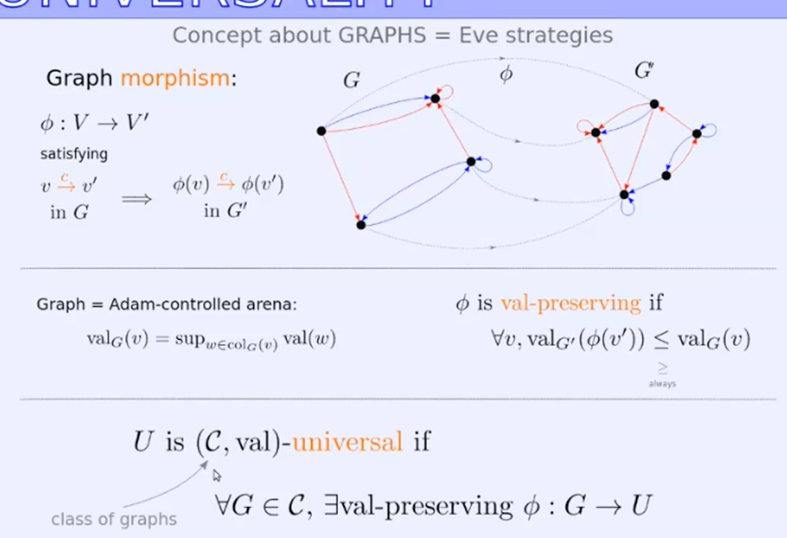
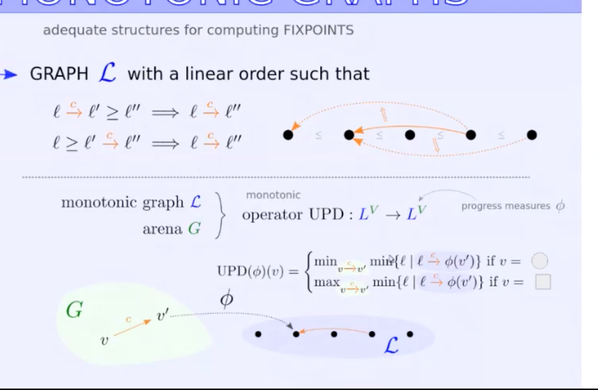
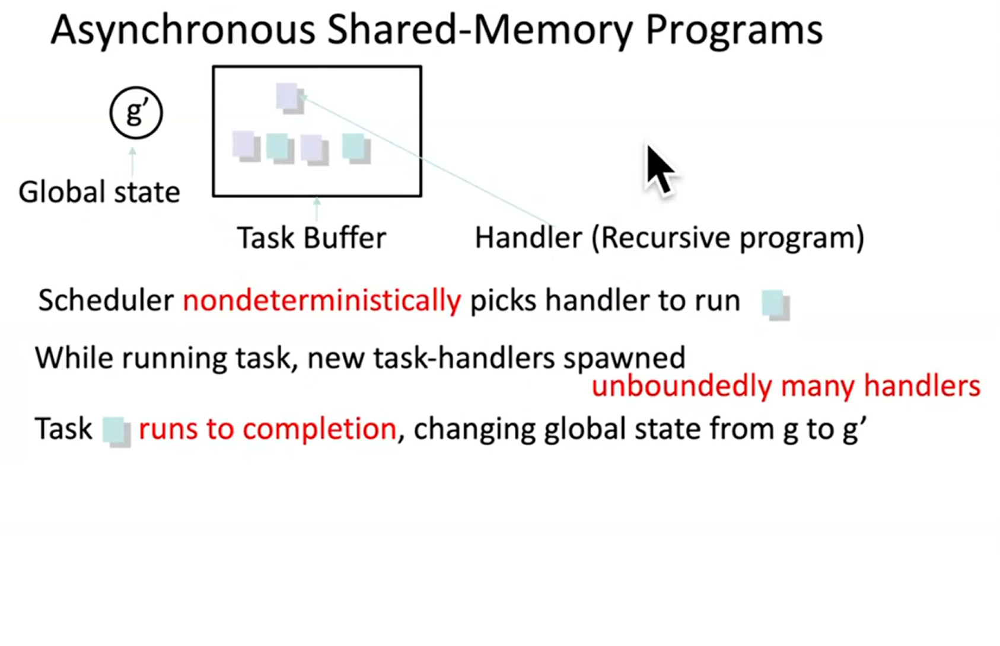

# Highlights 2021

# Most importnat points

## GFG automata etc.
* The question of Wilke: the size of alternating automaton for "there is a path"
* GFG alternating automata three is some gap in complexity
* It is not clear how to decide if a parity automaton is GFG. We know it for
  Buchi and co-Buchi.
* Open: deciding if an alternating automaton is GFG
* How to construct GDG automata (instead of determinization)

## synthesis
- No scalable algorithms for synthesis. Vardi promotes LTL_f coming from AI. [ltl-synthesis-vardi.pdf]
- Algorithms for LTL + (discounted sum>constant) aparently this is not known how
  to solve these games [Varid, Reactive synthesis]
- E-Nash questions. Instead of doing LTL over all paths they do them only on
  paths of an equilibrium strategy.

## parity games
- Daniel Hausmann has a boring result. But there is a POPL'21 work of Barbara
  Koening et al to look at.[baldan-fixpoints-popl21.pdf]
- Priority Promotion algoritm of Daniele Dell'Erba. This looks like a new idea
- Thejaswini, also a good work on parity games.[symmetric-parity.pdf]1
- Pierre Ohlmann. Nice work on theory of universal graphs with Nat and Colcombet

# Positive FOL on words
- Kuperberg has a very nice result. A simple examle for Lyndon's property (Stolbolushkin'95)
  He also has an undecidability result for definability of FO+. This is the
  first undecidability result for definability.

# Chana Weil and Bala
Equivalence of our parametric model with Delzano broadcast networks with
reconfiguration. [Gandalf'21]

# Rupak Majumdar
Parametric systems with pool of processes (asynchrounous shared memory). They
have a long sequence of results about this. [majumdar-parametrized-tacas21.pdf]

# Hole approximation of multi-pushdown systems
Ashkay, Gastin. 
They have a tool. Looks like a new and simple way of bounding things. 

# learning
- Adrien Boiret: gray box learning. We know something about what we want to
  learn. For example we are learning automaton recognizing well formed XML
  documents. [gray-learning.pdf][Gray-box learning of serial compositions of mealy machines.][GrayBoxLearningNFM2016.pdf]

# Lehtinen Good for games automata
* She prefers term history-deterministic automata
* A motivating scenario when there are very unlikely situations when there is no strategy.
  We should accept this instead of saying that there is no solution. 
  Notion of *good enough synthesis*. It is OK not to satisfy a spec if it is not
  the fault of the system.
	[Alagor,   Kupferman, CAV 2020]
* History determinism and good-for-games are not equivalent for quantitative sttting
* History deterministic: there is a resolver that says how to resolve
  nondeterminism by looking only at the part read, and guarantees success if the
  word is in the language.
* An example of a GFG pushdown automaton: a^ib^jc^k whith k< max(i,j)
  History deterministic automaton can resolve non-determinism because it has an
  oracle to decide which of i,j is bigger. There is no deterministic automaton
  accepting this language. 
* An example of succinct history deterministic coBuchi automaton: letters are
  connections between two pairs of n-nodes. The language is tiling where there
  is an infinite path (maybe not from the beginning)
  The nondeterministic automaton can made history non-deterministic: pick a path
  that was the longest uninterupted till now. (I am not sure that this works as
  she explains) [Kuperberg Skrzypczak, ICALP'15]
* GFG Buchi automata are equivalent to deterministic up to n^2 bound
* Alternating have exponential gap. 
  - [ ] TODO: is there a relation with the question about the size of the automaton
    there is a path?
* Open: how to decide if a parity automaton is GFG? We know it for Buchi and
  co-Buchi cases. What is the complexity? Apparently it is decidable. 
* Open: deciding if an alternating automaton is GFG.
* Quantitative setting: weights on transitions and the value of the run is a sum
  of values. The value of a word is a supremum over the values of the runs.
* GFG and history determinism is not the same.
  * GFG means the product GxA has the same value as G with payoff A.
  * Nice example with two states
  	  
		
* Open problems
  * Alternating automata that are half GFG
  * complexity of deciding GFG for parity automata
  * How to construct HD automata, in the same way as determinsation [Henzinger
    and Piterman] have some construction. 

# Mikolaj Bojanczyk
- Boolean combination and concatenation
- What is concatenation: graphs have ports and they are fused on ports
    
- This class is characterized by FO over graphs with connectivity relation
  R(s,t,x_1,..,x_k) path from s to t avoiding {x_1,..,x_k}
- He has a monoid characterization for bounded pathwidth graphs

# Shufang Zhu, Vardi Generalized reactivity specs and reactive synthesis
- No scalable algorithmms
- GR(1) appraoch [Bloem at al 2021]
- LTL_f approach in AI ??
- They have some classes where synthesis is efficient, they have an examle
- [ ] Look at the paper, as they have a tool GFSynth

# Nayak 
- Robust Linear Temporal Logic

# Clement Tamines Stackelberg-Pareto synthesis
Several objectives for Player 1.
Player 0 announces a strategy and the Player 1 announces his counter-strategy.
Then we check which objectives of P1 are satisfied. This is the payuoff for Player1.
So we want player 0 to win only against rational P1.
Some complexity results.

#  Thomas Steeples: Mean-Payoff Games with omega-Regular Specifications
Wooldridge
Concurrent games with mean-payoff
LTL specs are too expensive for them
they use \omega-regular specification: Boolean combinations of Inf(F)
They want to decided if a startegy is an equilibrium. And if there is the core
They have most of decidability/complexity results.

# Daniel Hausmann Uniform soving for \omega-regular games
[TACAS 2021]
They have an algorithm that computes fixpoints over any finite lattice.
Energy games as another example
Corollaly Nested fixpoint over finite lattices can be computed with QP number of
iterations.
- [ ] look at TACAS'21 

# Erich Graedel Semiring Provinence
Which literals are responsible for the truth of the statement
Computing winning formula in a given semi-ring.
A strategy that minizes occurences of moves?
Semirings need to be fully continours, and a+ab=b makes multiplication
decreasing ab<=a
Right semirings for fixpoint logics: <<<< see how to compute fixpoints in them
What we can read from such a polynomial: the number of all positional winning
strategies, 
We can reaper games: what are minimal repairs. In what sense they are minimal?
Absorption games: not clear why they are interesting, but they may have smaller
description than memoryless strategies. 
They know how to compute fixpoints in their semi-rings.

# Guy Avni, Bidding Graph Games
Poor man biding mean-payoff games. All players know budgets of other players.
Here they consider partial information bidding game: a player knows only a
random distribution on budget of the other player. 

# Lenchner, Forgotten logical game
A variant of EF played on sets of structures A and B. Every element of A
satisfies P and every structure in B does not satisfy P.
The new game determines r-quantifier depth. 
They have some results on number quantifiers needed to win on words and trees

# Leonard Subgame-perfect Equilibira and negotiations
Nash equilibria in many-player turn based games
Notion of non-credible threars

# Shaun Azzoparadi Monitors in Reactive Synthesis [ATVA'21]
# Motion planning, Grover
# Reactive synthesis Vardi
Environment is adverserial.
Satisficing goals: they do not have sound algorithms before theirs.
LTL + discounted sum value > constant.
They use comparator automaton for computing discounted sum (when factor is an
integer this automaton is a finite automaton).
Here they construct approximate comparator as a Buchi automata.

# Golia Manthan Boolean function synthesis
She said noting but that the results are very good

# Akshay Knowledge representation for Boolean functional synthesis
Given a relation on boolean variables, synthesize a function that satisfies this
relation (Skolem function)
The best we can hope for is Exptime
Decomposable negation normal form: gives a sufficient condition when problem is
easy.
Here even better form giving a class C* which is the best possible [LIS'21]

# Cooperative games, Julian Gutierrez, AAMAS'2019
They get a concurrent game structure with preferences, and a LTL property
Now not all paths of the game will not be used, We look only at paths that are
in Nash equilibrium. This decision problem is called E-Nash (find Nash
equilibrium, and a path satisfying LTL formula).
Here they do the same thing but for cooperative games. There is a notion of
core. Players can form coalitions to deviate together. 

# Daniele Dell'Erba Priority Promotion
What is tangle learning
  
QP are much slower than exponential approaches
They have implementation. HPP works almost the same speed as exponential solvers
They use something like priority promotion
Recent strategy iteration algorithm on universal trees of Loho and Koh

# Wojtczak Recursive approach
Parys idea to do half/preceision calls but for one call.
  
Parys algorithm is not poly if d is fixed. 
They proposed improvement where in the exponent there is only d. 
Gazda's family of games: the worse case known for Zielonka algorithm
On random games, Zielonka is much better. Even Warsaw variant is better than
theirs.

# Thejaswini, Jurdzinski A symmetric attractor-decomposition [arxiv]
  
 1](images/0d13bf648ccc086aef4fffd2bc6b609abb6ecd22447d20780950bc0730e7d511.png)  

Attractor basic algos are symmeteric, but have worse theoretical complexity
They have a symmetric algorithm with progress mesure

# Parity in timed games, James Main [CONCUR'21]
Two players simultaneously play delay and an action. If the players give the
same delay  then both actions are possible. 
Player 1 must ensure time divervence and parity (or not be able to play for
almost always).
Window objective: parity should be even in every window.
They reduce to safety or co-Buchi games. 

# Monotonic graphs.  Pierre Ohlmann
Universal graph: 
  
Monotonic graphs (adequate to compute fixpoints)
  
Monotonic graphs are witnesses to positional strategies
All this should be in his PhD thesis
Is the union of two positional winning conditions also positional? This looks
like a main of his universal graphs. The result does not work if he limits
himself to finite arenas.
Whenever you have something positional then you can have ordinal signature
associated to it. 
How to translate a parity game to mean-payoff so that the priority on cycles is
the same as positive/negative weight on a cycle.

# Weininger Simple stochastic games
Quadratic programming were not really looked at
In practice, model structure matters much more than its size
He compared three approaches: value iteration is on par with strategy iteration
Optimized quadratic optimization: almost as good as the other two, but it is
very volatile. 

# Rabinovich Uniformization in the full binary tree
What class of relation has an uniformization property
Gurevich and Shelah: MSO definable relations do not have uniformization
property.
Open: Decide if a given MSO relation has an unifomizer
If the cross-sections of MSO definable relatin over an ordinal are countable
then they admit uniformizer

# Inquisitive MSOL
Understanding the semantics of Inquisitive logics

# Lopez Gaifman locality, monotone variant
A sentence is preserved under disjoint unioins iff it is positive local sentence

# Amaldev FOL with Neighbour
Neighbour is a symmetric version of successor. 
Can all F(succ) properties be expressed by F(Neighbourg). No
F(Neigh) is not a variety of languages.

# Kuperberg Positive FOL on words
Lyndon: if a formula is monotone then it is equivalent to negation-free formula
Lyndon's thm fails on finite structures [Stolboushkin'95]
Here an easy proof
FO without negation on words. Alphabet, sets of predicated holding at each
position
There is a language that is monotone but not definable in FOL+
Undecidability of FO+ definability. 

# Nicole FOL with connectivity
Theses are Mikolaj's connectivity operators conn_k(x,z_1,..z_k)
Increasing k gives a hierarchy
disjoint-paths_k logic.
The two are sublogics of MSOL. 
conn_k is expressive with transitive closure. 

# Yde Venema
Closure size <= subformula size <= length of the formula
Difference may be exponential in each <=
Q: Notion of parity formula: how it is different from equation systems.
Thm 1: cleaning the formula may blow its closure size
So if one wants a result in closure size, one cannot assume that formula is
clean
They translate from mu-calculus to parity formula with the same closure and the
index that is alternation depth of the mu-calculus formula.
Q What about the closure size of the resulting formula? Is it clean?
What is canonical about parity format? 

# Guillermo Menendez
What is semantic in Marcos method. 
Commplete cut-free proof system Stirling 2014
He uses proofs with loops
Fresh fixpoint var for every loop leaf?

# Johannes Marti
What is the relation with the other method?
Focus system for alternation free formulas: you need to remember the trace, it
is enough to see what fixpoints appear infinitely often
Every formula can be in focus or not.
Q: Focus condition on loops in proofs
It does not have uniform interpolant?
- [ ] Give an example of an alternation free fomrumal such that its uniform
  iterpolant has index 2 

# Clemens Kupke Transforming to disjunctive formulas
They give exponential procedure without assuming the formula is guarded. 
Can we improve the index?
Q: satisfiability in terms of closure size?

# Martin Zimmerman
Are there fragments with better complexity? In particular, for Hyper CTL*?
What about hyper CTL?
Reason about two executions at the same time.
HyperLTL have countable models
Q: What about sat over finite models?

# Ouaknine Holnometric technics
Holonomic sequences are defined by recursion with polynomials on both sides
They have very good closure properties. 
They are defined by initial values and a recurence relation.
Equality is decidable for holonomic sequences
There is a notion of holonomic functions F:I-> Reals. 
Theorem: Identity is decidable for holonomic functions
Theorem [Fundamental]: A generating sequence of a function determined by a
holonomic sequence is holonomic function and vice versa.
Zilberger's method 
Theses techniques are not that useful for inequalities or asymptotics
They work on decidablility of these questions

# Vigny Parametrized complexity theory
Synchronous message passing model: 
  processes in vertices with identifiers, edges are communications
They want to decide if a graph is plannar etc.
They have local, congested, congested-clique models 
  In congested models the messeges should be small
They count the number of rounds needed to do the job
  They want to make classes similar to parametric complexity classes in
  classical complexity theory 

# Chana Weil Rocnfigurable Broadcast Networks
Reconfugurable broadcast networks [Delzano, CONCOUR'10]. There is a broadcase of
sent and many processes can receive. There is RDV on broadcast.
Asynchronous shared memory: processes access registers. 
There is no synchronization and only one process can access a register at any
time.
The two models are equivalent wrt to cube reachability. In particular state
reachability. 
Q: What about liveness properties?

# Felix Stutz Verification of asynchrnous processes, session types
Generalised projection operator
[CONCOUR'21]

# Ramanathan Decidability results for asynchrnous shared memory [TACAS'21]
  
For recursive programs this model is well understood
Here they consider higher-order functional problems: They just get decidability

# Czerwinski
PN-reachability in small dimensions are interesting (not elementary in dim 10)
Pushdown, branching VASSes are open wrt  reachability.
Some restrictions on VASS structure that make reachability easier?

# Leroux

# Adrien Boiret
What if we know something about solution? 
Gray box learning [See DLT'21 paper]
The idea is that like n XML we are just not interested in strings that are badly
formed. 

# Daniel Stan 
Learning finite union of cubes in N^d. Dimension is fixed, Cubes can overlap.
A natural algorithm, but why they do it?
They use for monadic decomposition of formuls. 

# Dolav Nitay Unambigues proablilistic grammars 
The model is vey much used in linguistics and biology
This time we ask what is probability that a grammar accepts a given word.
Complicated structural membership querries. 

# Learning realtime one-counter automata
They learn behavior graph of an automaton: this is an infinite graph of
configurations. 
Such a graph has a periodic structure (for all automata in question)
Then they apply learning for visibly one-counter automata.
They want to use it to verify in JSON or XML files

# Jan Otop Infinite word automata
He does like to learn encodings of periodic words u@v because it is
exponentially more biger.
No counterpart of Myhill-Nerode theorem for omega-regular languages
No unique minimal automaton.
Minimisation of DBA is NP-complete, and learning gives the minimal automaton. So
we cannot have a fast learning algorithm.
Here they learn a specific automaton. They add more queries
uw^\omega\in L
Loop index queries: about the structure of an automaton
Minimization problem for limit avarege automaton is not known to be NP-complete.

# Rajarshi Learning Linear Temporal Properties
From observations of behaviours he wants to get a description in LTL
They want a formula missclassificaying at most a given fraction of examples.
Reduction to MaxSat. They encode all formulas of size n in to a SAT formula.
This is exponential in the size of the formula.
They then go for boolean combination of 
[FMCAD'18]

# Xuan Xie Neural network robustness certification
They represent machine learning by a finite automaton??
They use learning to approximate machine learning model. 

# TO LOOK AT later
*  Pascal Baumann: Context-Bounded Verification of Liveness Properties for Multithreaded Shared-Memory Programs
   Once again a model with pool of proceses. Each process is a pushdown. It can
   be preempted fixed number of times (K). They show that liveness under
   faireness assumptions is decidable. Extending VASS covering to VASS covering
   with balloons.
*   Nicola Gigante: BLACK: a fast and robust tool for LTL satisfiability checking
  Flexibe: suppoets LTL+Past
  Robust: works on all platforms
  SAT encoding of Tableau method (single pass is sufficient)
  Reynold's tableau prunning technique
  They uncode tableaux up to a given depth, and then increase the breadth
  Constructing formula of level k+1 is incremental of level k.
  They have 3000 formulas to test.
*  Sparsa Roychowdhury: Hole Bounded Reachability in Multi-Stack Pushdown Systems – with and without Time
  Akshay, Gastin, Krishna
  Multistack pushdown automata. 
  Bounded round, bounded phase, .. 
  Here new approximation called "hole bounded".
  They detect well-nested sequences. 
  If there are never more than K open holes in the run then OK.
   This is orthogonal to bounded phase approximation, but it is better than
   bounded scope.

#conference