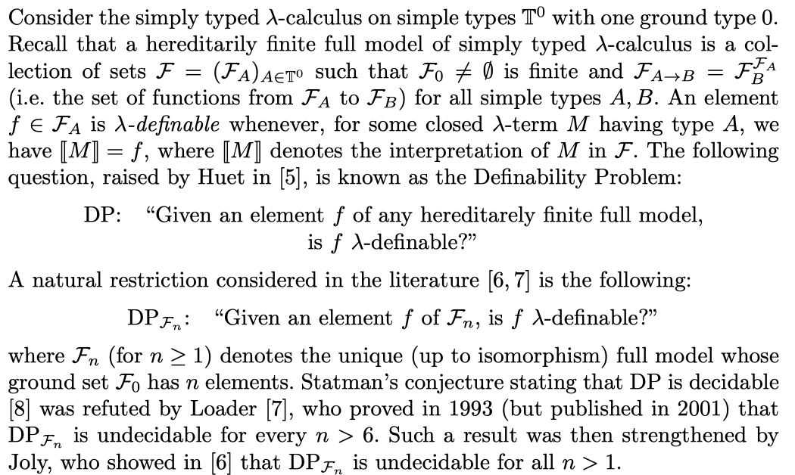

# Lambda definability

## Very succinct statement for definability problem from [salvati-loader-urzyczyn.pdf]
    

## Some remarks after Barendrekt chapter [barendregt-definabiliyt.pdf]
- Definability is decidable if we fix a finite model and the type (because there are
  finitely many elements in this set). So we need to either parametrize the size
  of the model, or the type
- Joly 2005 has shown that Def(n,3->o->0,d) is undecidable. 
  This means that we look at models varying size n in the base type and ask for
  definability of an element d in the monster type 3->o->o.
- Joly 2003 Def(n,A,d) is decidable iff the closed terms of type A can be
  finitely generated. This means that there is a finite set of terms, not
  necessary of type A, from which all terms of type A can be generated. 
  For example in the type of Church numerals 1->o->o all terms are generated by
  0 and succ.
- 