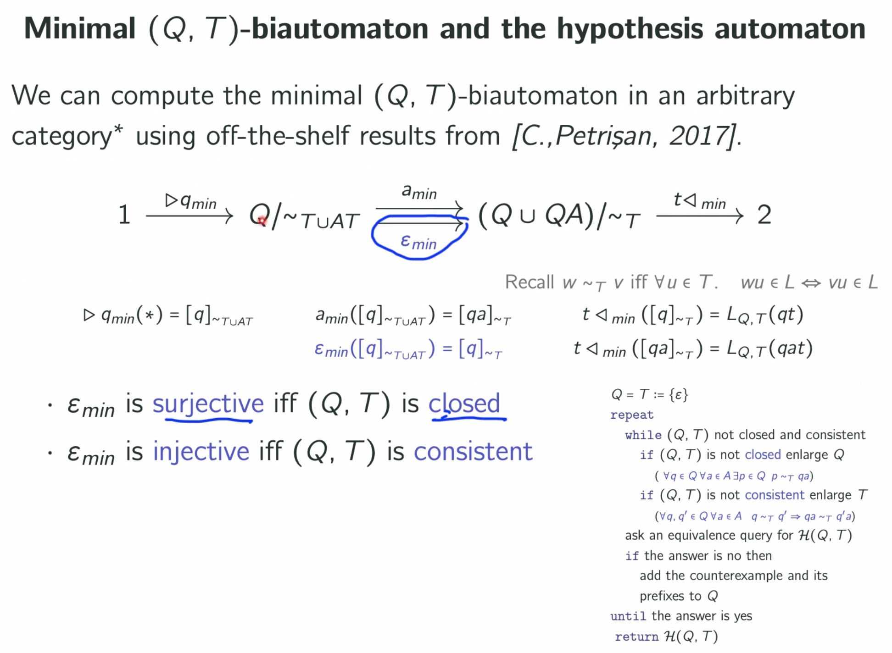

# Learning automata: categorical approach

Thomas Colcombet
#seminar 2022-02-15

Link between learning and minimization

[Learning meets verification'2007] He sees that there are plenty of
applications!!!

Why he has consitency: normally we take Q that are pairwaise not equivalent.
This is because he adds states blindly.

He will not talk about how to process counterexample !!!

Many extensions nominal automata van Heerd 2017
symbolics automta Drews 2017
Angluin automata, Angluin 2015

Parametric definition of automata (1,2,Set)-automaton is a deterministic
complete automaton.
(1,1,Rel)-automata are NFA's
>> Q: does every parametrization make sense? For example (1,2,Rel)
(K,K,Vec_K) weighted automata over the field K.
(1,2,Kl(T))-automata sub-sequential transducers

Thm: existence of a minimal automaton in particular class [quotient of a
subobject].

Q: Is minimization always like this?

Closedness == surjectivity of \epsilon_min
Consistent == injectivity of \epsilon_min
  

If these maps are surjective and injective then we get a real automaton.

Q: he adds all letters to Q?? Then he adds all AT to T? This is to make the
presentation simpler.

Q: How he processes counterexamples??

