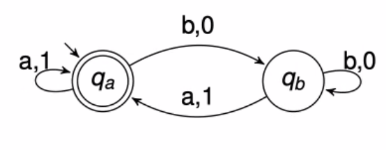

# Learning omega automta

Jan Otop 
#seminar 2021-12-14
[otop-leanting-omega-automaat.pdf]

My general understanding is written below.
It is by far not clear what happens in the case of acceptance on transitions.
It is not known if minimization is NP-complete in this case. 
The same holds for limit average automata, there is no complexity result on
minimization. 

Q: what about learning in the limit a la Gold: positive and negative examples,
there should be a polynomial sample that determines the minimal det automaton
Q: what is the complexity of the algorithm (in particular on the loop index)

## [Learning the Language of Error, Chapman]
Bounded model checker of C-programs
Problem is that the returned counter-examples is very tedious
Construct DFA representing sequences of events leading to counterexamples. 
Use L* to learn this DFA.
Learning infinite counterexamples could give explanations for bugs for liveness
properties.

## State of the art
Either learn the set of (u,v), but the automaton may be exponential.
There is some representation that is polynomial (Family of DFAs of [Angluin
2014]) 
There is no canonical minimal DBA.
There is no solution because such an algorithm can be used for minimizing DBA
and this is NP-complete. [Schewe'10]. This is assuming that the learning
automaton returns a minimal automaton.

## Their result
Teacher knows an automaton. Learner needs to learn an automaton of size not
bigger than the target automaton. 
How to find queries that do not trivialize the problem?
The notion of necessarily rejecting state (appearing on a rejecting loop)
  

How to distinguish qa and qb

Notion of $Cycles(u)$. This defines an equivalence relation that allows to
define a DBA. 

Query: for words c,d given the minimal position in cd^\omega we reach the
ultimate cycle in the automaton.

## Learning limit-average automata
Limit supermum of averages of weights of prefixes of the run.

## Learning VPA
There is no Myhill-Nerode for them
Minimal DVPA are ambiguous
Minimization is NP-complete (even over single letter stack alphabet)
Shortest counterexamples can be of exponential length.
Q: why not learn trees?
Equivalennce relation defined with the use of new reset letters.
They use grammar compression to work with only polynomial size examples. 

## Some understanding 
The relation cycles(u) depends on automaton. 
In the algorithm they want to have a normal relation given by MN-congurence plus
distinction if a state is accepting or not. This is done with testing loop index
The test is used in one specific way: given uv the algorithm asks if in the
state reached by u there is a loop on v in the automaton. Then it is clear if
this loop is accepting or rejecting. If it is rejecting then the state reached
by u is rejecting. 

There is a direct construction of an automaton from the equivalence relation
they have defined. 

