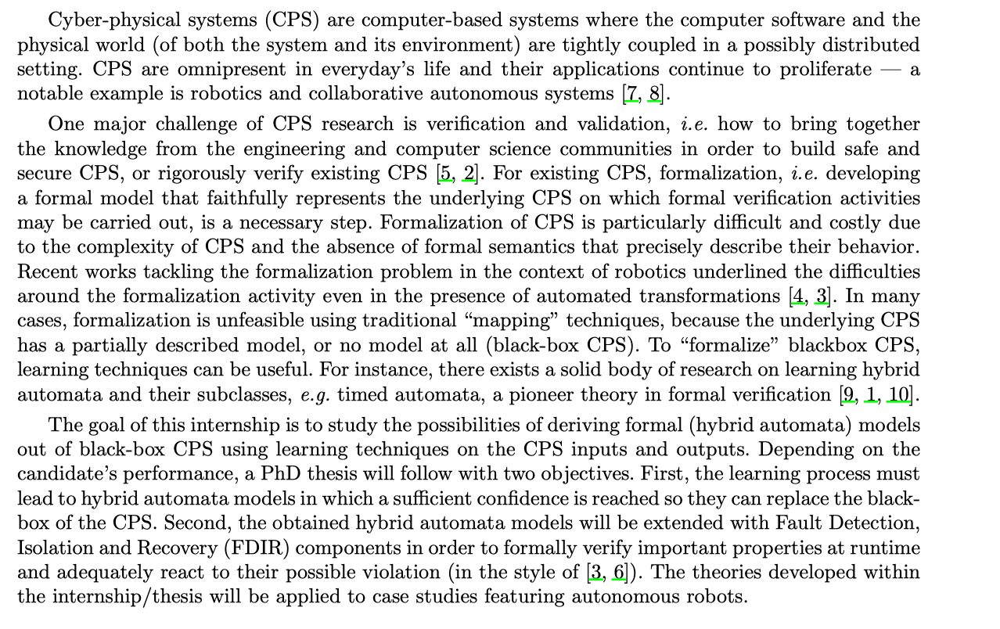
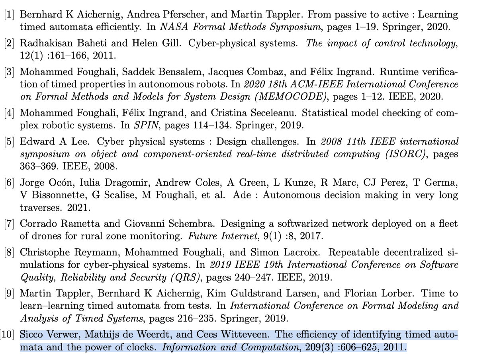

# Learning timed automata

The most recent paper is probably [[learning-automata-with-one-timer]].
There is also TACAS'20 paper [Learning One-Clock Timed Automata] of some Chinese
people.

There is more literature in a recent Phd subjec of Egene Asarin
- Bernhard K Aichernig, Andrea Pferscher, and Martin Tappler. From passive to active : Learning timed automata efficiently. In NASA Formal Methods Symposium, pages 1–19. Springer, 2020.
  [learing-timed-automata-2020.pdf]. Once again they use Genetic Programming
  based techniques to produce automata. 
- Martin Tappler, Bernhard K Aichernig, Kim Guldstrand Larsen, and Florian Lorber. Time to learn–learning timed automata from tests. In International Conference on Formal Modeling and Analysis of Timed Systems, pages 216–235. Springer, 2019.
  Does some genetic algorithm to produce candidates that then are tested agains
  the black box.
- Sicco Verwer, Mathijs de Weerdt, and Cees Witteveen. The efficiency of identifying timed automata and the power of clocks. Information and Computation, 209(3) :606–625, 2011.

  

  

