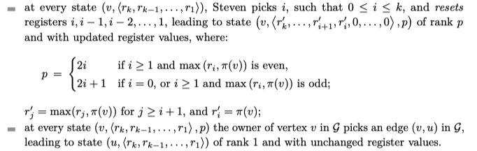
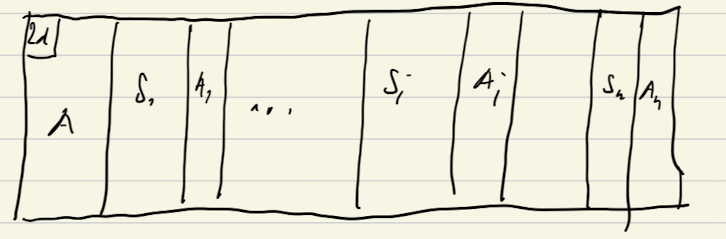

# Lehtinen solving parity games

This is a description of Lehtinen's approach to solving parity games. 

We show that if $\Gg$ has an attractor decomposition of Strahler number $k$ then
Eve can win with $k$-registers.

The rules of using registers are the following

  

We require that $2d\geq r_k\geq\dots\geq r_1$.

Consider an attractor decomposition of Strahler number $k$:

  

Suppose that only $S_i$ needs $k$ registers. We want to show that the whole game
can also do with $k$ registers. 

The biggest rank is $2d$, and it appears only in the corner. Ranks $2d-1$ appear
in $A_1,\dots$ that are attractors to $S_1,\dots$ where we have hierarchical
sub-decomposition. 

We should be very careful about putting $2d-1$ into register $r_k$ because
updating this register with something smaller than $2d$ leads to flashing
$2k+1$, and we cannot neutralize it. 
So the best is to have only $2d$ in $r_k$.

To win we play with $k-1$ registers in all parts but $S_i$ putting $2d-1$ into
$r_{k-1}$ (assuming that $r_k$ contains $2d$) when we see it in $A_j$ parts. This
results in a flash of $2k-2$ color when we start playing in $S_j$, but only one such so we still win if we stay in
$S_j$. 

In $S_i$ we play with all $k$ registers. This makes $2k$ flash when we rewrite
$r_k$ register, but now we are in danger as the value of the register is
something smaller than $2d-1$. 

When we get out of $S_i$ we play with $k-1$ registers.
When we see $2d-1$ we put it into $r_{k-1}$, and this makes $2k-1$ flash when we
want to use $r_{k-1}$. Since this happens only in $A$ parts we do not worry too
much about it. 
The crucial point is that there is no other $S_j$ that needs register $r_{k}$,
so we leave it alone, and either we win by staying in some $S_j$ or get to $2d$
where we can rewrite $r_k$ register. 

### Why Strahler number is logarithmic?

If at some level of the decomposition the Strahler number decreases then there
are two subgames with the number-1. Thus Strahler number can be at most logarithmic.

## Questions
* Mju shows that register number is the same as the Strahler number, in the
   above we show only that register number is $\leq$ Strahler number. 

## References
[/Users/igw/Library/Mobile Documents/com~apple~CloudDocs/Papers/lehtinen-mu-calculus.pdf] 
[/Users/igw/Library/Mobile Documents/com~apple~CloudDocs/Papers/lehtinen-register-games.pdf]
[/Users/igw/Library/Mobile Documents/com~apple~CloudDocs/Papers/mju-stahler.pdf]

#fixpoints
