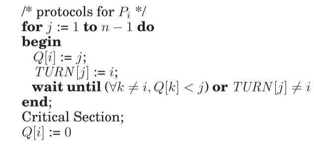

# Paterson algorithm

Algorithm with good notation is in
[multiprocessor-programming.pdf]

  

The idea is that there is a wave of processes stopping at different gates Q.

This algorithm can be interesting for WW reduction. 
In the first wave all processes do $Q[i]=1$ and $T[1]=i$ 
These commute, but for the last write when using WW reduction. 
Unfortunately, there will be a lot of interleaving still because of $Q[k]<j$
test that will interleave with $Q:=j$ assignments.

The example comes from [valamri-stubborn.pdf]. 
Valmari can reduce the state space 3-fold. He says that the example is not
treatable with the standard symmetry reduction technique (because of the test in
await that is implemented as a for loop.)

**Problem:** It is not clear how symmetry can be used to reduce the state space
here. The await statement has an implicit for loop inside that is not symmetric.
Moreover this for loop is hardly treatable with POR as tests can be interrupted
by writes to the variables.

There are some global states that can be reduced by symmetry, but processes that
are in the for loop cannot be reduced. So the global state with one process in a
for loop cannot be reduced. 

*Remark:* It is not clear that we have symmetry at all as a symmetry would
change the loop to something different. 
Instead of a loop we really need the symmetric statement $\forall k\not= i.\
Q[k]<j$.

**Good news:** If we change the loop so that it starts from $i+1$ for process
$i$, and it goes modulo, then it looks like we regain symmetry. This would be
very good, as we could hope for more gains in Paterson. 

*Q:* would it be symmetric if we consider wait as an atomic statement?
Looks like yes.

#partial-order