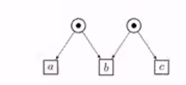
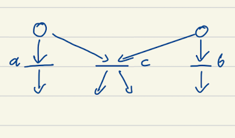
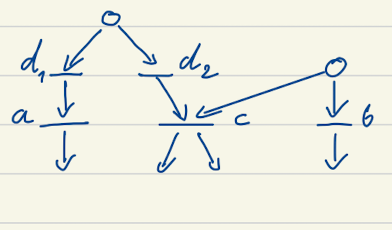

# Petri nets vs asynchronous automata

Intriguing concept of M structure:
two transitions do not share a resource but still they are not concurrent because
they have another transition that is using the two. 
The intuition is: For the decision/choice (to send) on the part of the sender takes place
strictly before the decision/choice (to receive) on the part of the receiver.

So this is M:

  

  

But this is not:

  

What if we disallow M structure in asynchronus automata. 
Q: is there a compositional syntax for Petri Nets without M?

There is also an N structure that can be avoided.

There is notion on  M-free PN's. It is very common that the implementations are without
M. Rob van Glabbeek says that they have a very big practical impact. 

## Letter from Rob:
Although there are several papers studying theoretical properties of
Petri nets without M, the answer to the question for papers that employ
such Petri nets in realistic system modelling or verification, or that
recognise existing Petri nets used for system modelling or verification
as M-free, is negative. I do not believe such papers exist.

My claim that "they are common" is based on personal experience (not so
much with Petri nets, but with modelling and verification of realistic
systems in general), but not on any published paper.

I will try to substantiate this claim in this email.
Note that I want to make a claim about models of realistic systems in
general, regardless whether Petri nets or other modelling frameworks are
used. The claim is thus not so much that no M's can be found in many
common system models, but rather that when these models would be
translated to Petri nets, they would be M-free.
The synchronisation pattern M is in Petri nets easily recognisable, but
it exists in most other frameworks as well.

Many applications consists of the parallel composition of a number of
sequential processes, communicating either through shared variables,
asynchronous message passing, of synchronous (CCS-style) message passing.

An M in a Petri net involves a central transition with two preplaces,
such that each of these preplaces is also a preplace of transitions at
the sides of the M. These two transitions should not have a common preplace.
And there must be a reachable marking such that all three transitions
are related.

In shared-variable concurrency, the central transition in an M must be
the synchronisation of one of the parallel components with a memory
holding the value of a variable. One of the other transitions in the M
must be an alternative access to the same memory by another component.
This implies a data race. Data races can be avoided with mutual
exclusion protocols. In the paper at
http://theory.stanford.edu/~rvg/abstracts.html#156
on page 35, you see a Petri net of Peterson's mutual exclusion algorithm.
You can check that it is M-free.

Asynchronous message passing is know to be M-free.

Synchronous (CCS-style) message passing is more difficult.
Often only binary synchronisation occurs (as in CCS),
of which one participant (the "sender") plays an active role, and the
other (the "receiver") a more passive role. In this case the middle
transition in the M must be the synchronisation between sender and receiver.
Often the receiver has an alternative to receiving a message.
This leads to the pattern N, a subpattern of M. It explains why very
few realistic systems are N-free (or Free Choice Petri nets).
But often we have that
* a sender that can synchronise does not have the possibility not to synchronise.
 In CCS, a term $\bar{a}.P$ does not occur in a +-context,
 and if the complementatory action $a$ occurs in the model at all,
 then $\bar{a}.P$ must occur within the scope of a restriction on
 $a$, enforcing synchronisation.
* for each sender ready to partake in communication, there is only one
 other component that can play the role of receiver for that
 synchronisation (thus avoiding a race between two receivers trying to
 synchronise with the same send action $\bar{a}.P$).
When these conditions are met, there will be no Ms.
They are met for the alternating bit protocol, the sliding window
protocol, and a host of other protocols. Although I didn't check this
explicitly, I have the feeling that a lot of process algebraic
formalisations I saw in my life fit this class.