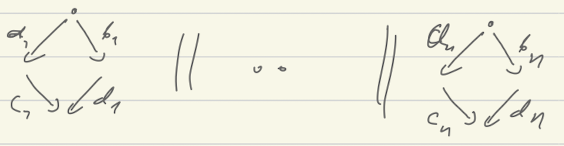
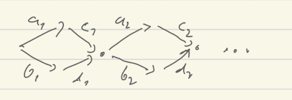
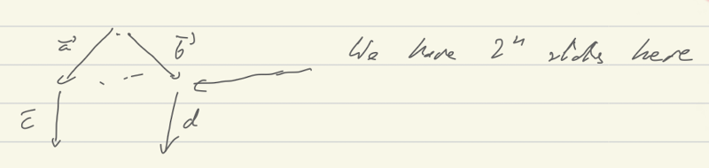

# POR todo

- [ ] Subsumption should not be a big problem for DPOR. The subsuming state has
  more behaviors.
- [ ] Blocking is more serious problem for DPOR. Not clear how to adapt it.

- [ ] There is a serious problem with branching systems. POR is a very unstable
  wrt. to order of exploration

  

There is a small exploration graph
  

But there is also a big one
  

- [ ] Abdulla for systems with shared variables (stateless). 
  - [X] Write a simple algorithm
  - [X] Maybe there is an algorithm that requires very little memory
- [ ] POR is useless for shared variables when we store states (if we do not
  have local actions)
- [ ] POR for two player games. How to reduce a game to a smaller game with the
  same winning positions. Stubborn set approach for reachability games is
  described in [larsen-untimed-games-por-lmcs2021.pdf]
  - Our POR methods for real-time may be directly applicable. It would be worth
    to start with one server system. Then read/write systems with one or several
    variables. Q: what is a difference between several servers and the general
    of communicating automata? 
    (Servers cannot communicate between them. They can use special clients to
    simulate this. Clients can only talk to servers no direct RDV between
    clients. The real intersting thing for POR happens when we have only R/W
    operations that are somehow non-blocking, and every client is a
    deterministic program).

#partial-order