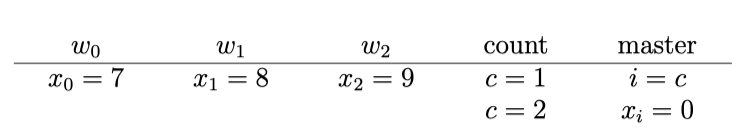

# Quasi optimal POR CAV18
[[2021-06-16]]
“Quasi-optimal POR”, CAV’18
[quasi-optimal-cav18.pdf]

She introduces a notion of alternative: taking alternative does not lead to  a sleep set. 
	* The notion of alternative comes from Kroening et al paper from 2015
  * She shows that finding an alternative is NP-complete but in the size of the
    state space of the PN and not in the size of PN itself.
  * There is an interesting example where SDPOR is exponential and optimal DPOR
    is linear
  * The main result is POR method using $n^k$ memory instead of $2^n$. Here $k$
    is a parameter given by the user.

## Example where optimal POR is much better

  

The idea is that count process increases the counter. As some moment master gets
one of these values into i and sets x_i. So in a particular interleaving there
is only one writer that is dependent on master. 
But this dependence is dynamic and cannot be precomputed statically. 
Statically we can only say that all the writes are dependent on x_i=0.
This leads to exploration of 2^n executions instead of O(n) when we discover the
independence dynamically. 

Q: Can we replicate this phenomenon in transition systems? Probably not because
we need different transitions for different i. 

# TODO
TODO After discussion with Akshay at LICS’19 (Conceringin optimal POR)
	•	Have an algorithm that is linear space and time wrt to the result (optimal unfolding)
	•	PSPACE hardness for finding Alternative set.
	•	Understand what are the restrictions in Parosh paper.

# Old notes:

They use vocabulary of even structures, which makes things more transparent.
Given a program they construct an unfolding event structure.
They make distinction between commutativity in a state s, and independence in a state s, the second is an approximation of the first. 
They do not say how they obtain independence relation. 

Question: is independence in a state sufficient for POR? It may be that two actions are independent in one state but when we move to the next sate they are no longer independent. 

They construct unfolding in the standard way. 
Now the goal is to construct only one execution per trace-equivalence class (this is automatic in unfolding setting), and do not get sleep-set blocked (this is where we loose optimality).

To not get sleep-set blocked we keep a set of events to avoid, and a set of events to privilege. 

The core of the exploration procedure is the definition of alternative: it is an extension of the current configuration that is in conflict with  all events that we need to avoid. This is a proof that we will not be sleep-set blocked. If we have an alternative then we are sure that exploring the alternative will not block us.

In general unfolding algorithms find only clues and not alternatives: this is a configuration extending the current one and not having forbidden events D. This notion is weaker because nothing says that in the future all configurations will need to have something from D.

They show that deciding if we have an alternative is NP-hard. The proof is a trivial reduction from 3-SAT. They say that finding alternative is in NP, but it is only in NP in the size of the whole state space (as an event structure). If we just have a symbolic representation of the state space then it is not so clear. 

They say that optimal POR is when you can compute alternatives. So the whole
point is to compute alternatives efficiently. 
