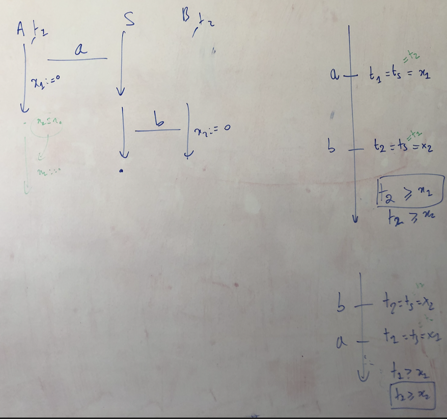
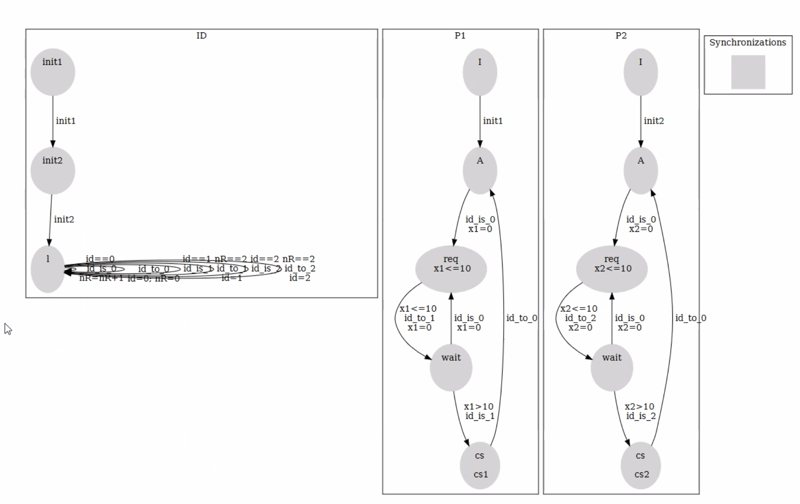
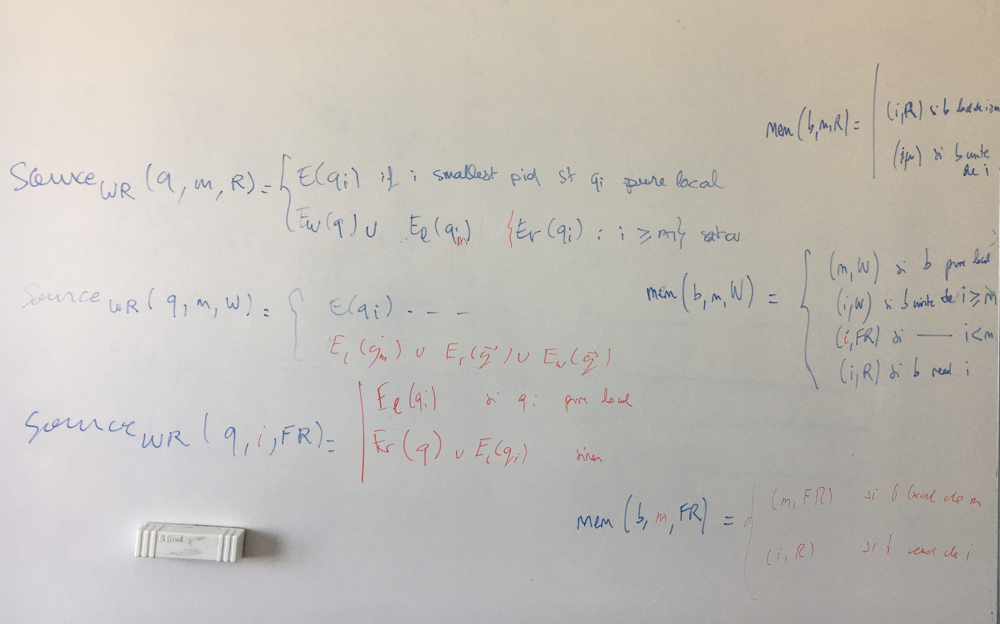
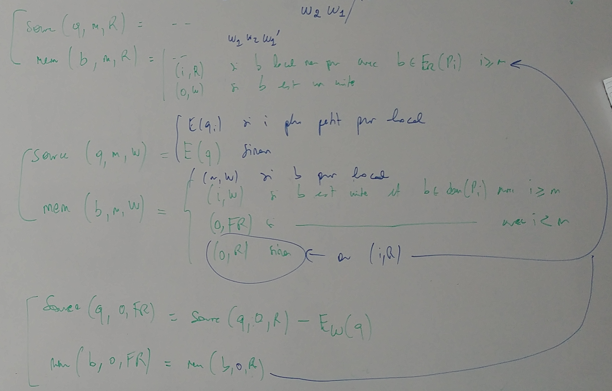
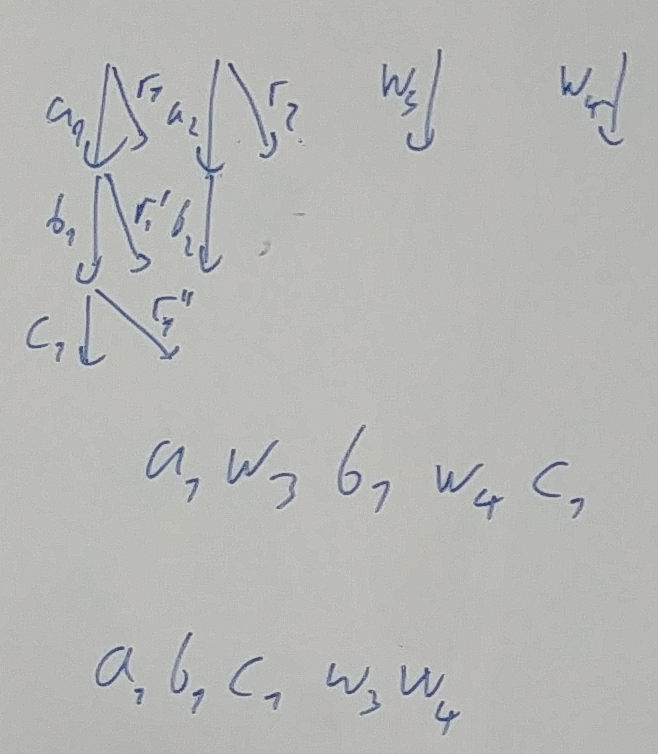

# Sarah Parital-order

- 2022-05-03
  - WRR can give gains only when we have phases of reads followed by writes etc.
    When every process can do WR and they are all in parallel, we gain nothing
    because all the reads and writes get mixed.
  - There is a problem with my short-multi-server as the algorithm can block
    before exploring everything.
    
- 2022-04-12
  - When WRR may be correct? It is not even for 0-spread systems.
  

- 2022-03-29
  In what examples we can have gains with WR, or with global/local?
  - [ ] Test Fischer after Frederics translation
  - [ ] Do Ocan models with merging several processes into one.
  - [ ] Do multi-server as there is no hope otherwise. We need blocking because
    we are exactly fighting against blocked executions. 
    But it is almost essential to have branching too. This is important for
    example when we group some processes together as one. The group has
    branching. 

- 2022-03-25
  There is a problem with commutation in a server.
    

  - One option is to do better LU to detect that a process does not synchronize
    with a server before reseting its variable
  - The other is to have as many independent actions as possible. 
  - In 0-spread RR may be correct: maybe we need weaker definition of 0-spread
  We will do transformation of Fisher to client-server with local actions (even
  taking into consideration WR commutation)
  We also need  better reduction for global-local, because it does a mess on
  things like Fischer. Even if only local actions are available in a state, it
  will start exploring all of them in parallel, because it does not know when a
  global action can hit (is this true?)

- 2022-03-22
  There is a problem with subsumption when there are invariants. We do not get
  commutation of independent actions because invariant makes zone remember the
  order of actions. 
  Soulitions: 
    (i) move invariants to transitions
    (ii) do smarter subsumption
    (iii) maybe we should do more clever spread 
  
- 2022-03-04
  - [ ] Are trigger->action specifications bounded spread? Trigger and Action talk
  about bounded intervals. This is a thought after Ocan's talk at TikTak meeting. 

- 2022-03-01
  - Init duplicate themselves: maybe exponentially many times
  -   

- 2022-02-07 
  - Advanced cuts 
    Some optimizations
  - Write complete
    This is too strong. States are partitioned into 
  - WCET 
    Is even worse. What conditions on writes we need for our method to be
    complete. This is not a read/write system.
  - Timed cut: this is not yet implemented.
  - [[dynamic-partial-order]]

- 2022-01-04 Multiple variables
  - To deal with multiple variables it may be better to use execution graphs of
    Vafeiadis than traces [vafeiadis-popl22.pdf]. Figure 4 shows that we can
    have 4 graphs and 12 interleavings. What we do with one variable is cheap
    way of simulating read from pointers. 

- 2021-11-23 RR-por
  - This POR is almost like glueing local actions after R/W. The problem with
    glueing explicitly is that it can produce exponentially many "glued paths". 
    The method we have is better in this sense.
    -   
      To this image we add forcing local actions of $q_m$ when $q_m$ pure local 

- 2021-11-16 RR-por
  - RR-por is not optimal because it admits r1,l1,w2 as well as r1,w2,l1.
  - We can force l1 to appear close to r1 but then we need to remember who has
    done the last write. This looks dangerous as maybe we need to have set
    memory. 
  
- 2021-11-16 POR in Games
  Larsen's paper on partial order reduction for timed games
  [larsen-formats21.pdf] 
  His untamed paper looks correct [larsen-untimed-games-por-lmcs2021.pdf]
  In timed setting they do induction differently in order to avoid talking about
  depth of a strategy that is difficult to define when branching is continues.
  There is some problem with their argument. Sarah will see if the same kind of
  argument works in untimed case. If so then there is probably just mess-up in
  writting. 
* [[2021-10-26]]
  An idea of WR reduction.
    
  The idea is to have phases of reads and writes. 
  Reads happen in the non-decreasing order of processes
  A phase of reads is broken by a write.
  Writes happen in non-decreasing order of processes, but for the last write. 
  So the write out of order signals the end of the write phase (this is the
  reason for FR memory content.)
  Also a read signals the end of the write phase. 
  The question is how to treat local actions. 
  Of course we can give priority to pure local.
  But what to do in mixed states?
* [[2021-10-26]]
  When we do POR we should do sleep sets at the same time. 
  Normally when we keep states we do not need sleep sets, because sleep sets are
  exactly there not to get to the same state. 
  The point is that reductions other than POR1 are not optimal but they leave
  holes. 
  If we do not do sleep sets then these holes get filled with unnecessary
  explorations. 
    

* [[2021-10-11]]
  Sarah has broken arm and has not advanced much. 
  She will implement POR1 in the new implementation of TChecker. 
  Then she will do work on RR.
  At the same time she is going to read Larsen's article from FORMATS'21
  
* [[2021-10-04]] Discussion on RR por
  It looks like we have a nice definition. Sarah should prove that it is correct
  There is also a reasonable definition of branching POR. It tries to expand
  first on things that have the smallest branching. 
* [[2020-09-09]] Work on the report
  [[sarah-report]]
  
* [[2021-08-28]] TODO
  - [ ] Read and tell us about the article of Larsen from Formats'21
   
* [[2021-07-12]] 
  * They work on mutex. There is 10x gain
  * She will describe why one method is better than the other on some examples.
  * She needs to write what she has added to TChecker
  * Test if there is really time in WCET
  * Try J1850 model
  
* [[2021-07-06]] Some analysis of the resulting WCET model
  * There is some inefficiency when we do the first sequence of init actions.
    Ideally all processes should do their init, and then other things should
    start. We develop first completely one process (with its branching) and only
    then do init on another process
  * A heuristic: if there is unique action server can do move the process with
    which the server needs to synchronize. This may also help with access cache
    loop where otherwise we can have some useless branching too (but we dont
    looking at the model)
* [[2021-07-05]]
  * simple WCET model has very good reducions
    * add time: total execution time is not bigger than t; each process takes
      not more than t'
    * Add more actions in place of \tau from s2 to s4 so we can simulate access
      to local cache.
    * Do more than one instruction

* [[2021-06-28]] Where to find some gains
  * In more complicated models we have local actions.
    * In WCET we make a product of some components in order to put it into
      client/server form. This merge produces local actions. 
    * Q: can we have a more ambitious POR that will also do some reduction when
      between merged components? This is maybe not necessary for WCET because
      there are no local actions in components we merge so we will not gain
      anything.

* [[2021-06-19]] Reflections on what to do 
  * It looks that even with many variables POR does not give anything [[por-is-useless]]
  * We should try stateless model-checking, this way we gain on the number of
    transitions we explore 
    * First we need to check what happens in the case when every process does
      one read and one write. It looks like there is the same number of states
      but much less paths.
    * Then we need to implement sleep sets. It looks like current RR-POR already
      does it. 
    * We should try it on Fischer unfolded several times (starting with 1 unfolding)
    * The point is to see if we can get substantial increase in the number of
      processes we can handle. 
    * Is stateless MC we will still have diamonds on writes (R -> W in Fischer).
      We should implement something what they do in weak memory models to say
      that w1w2w3 is equivalent to w2w1w3. So we need a notion of write
      transition and equivalence under context: if write transition is not read
      then it permutes with other write transitions. 
      * [[todo]] Define this order for one server.
  * Later we can try to do MC with storing only some zones. This did not work
    before because we got explosion on exploration paths. Maybe now it can work.
    It would be interesting for example to get through bigger Fisher thanks to
    storing only states of some form.
    * For example in Fischer Abdulla, it looks like we need to keep only
      processes that are in A or Wait states. This is still not very impressive,
      as we have only 4 sates in total. We need bigger models.  
  
* [[2021-06-17]] Meeting
  * Discuss questions from [[govind-defense]]
  * It looks like RR does not help at all. Look at fischer-abdulla1.pdf. There
    maybe we can have some more independencies due to test x\not=1.

* [2021-03-06] Meeting
  * POR1 vs CS
    * They have removed some deadlocks
    * They have added some covering for POR1
    * It is still much worse than local zone exploration.
  * Experiments POR1 vs POR3
    * POR1 is better for mixed states
  * She has not looked at POR5
  * Magnetic method
    * mixed states are considered as sync states
    * It looks like POR1 and POR3
  * Discuss the role of E
  * POR5, what is her idea and what is mine.
  * [TODO] Merge magnetic POR, and narrowing.
  * RR-POR
    * how to get more R actions: when changing a zone does not disable other actions
  * Examples on which to try RR POR
    * Fischer (all variants)
    * Lamport Fischer (problem as there are two variables)
  
/Users/igw/Library/Mobile Documents/com~apple~CloudDocs/Papers/
* [2021-28-05] Meeting
  * Implement magnetic POR for experimenting
  * On "local plus comm" example, POR1 works better that POR3. Simulate this
    with magnetic POR
  * Do optimal POR with RR independence

#sarah
