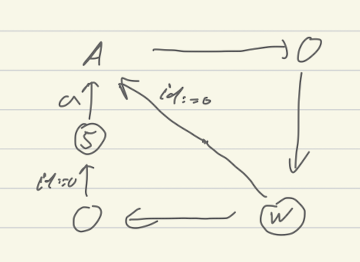

# Sarah-report

Questions and conclusions after report of Sarah.

* por1 looks like the best method. 
* What is the difference between por1 and cs? 
  * Allowing pure local to move first
  * CS is more prone to deadlocks.
* por3 looks very promising as it makes blocks of sync and local
  * It gets worse results because of cutting deadlocks is less efficient?
* What is the problem with por5?
* Method rr should be better but no on the models she considers.
  * it is much better on kac and kac_c
  * We should combine rr with por1: give priority to local actions
* Magnetic on transitions. When we have magnetic on states then sometimes we
  need to make state magnetic when there is a local and com transition entering
  into it. While POR1 will make a difference between taking these two
  transitions. 
    * Fisher diamond is a very good example where mag is worse than por1. In
      POR1 we get out of state 5 immediately, in mag state 5 needs to magnetic
      if A is not. In consequence we can have several processes in state 5. What
      we need is magnetic actions not magnetic states.

  # What to do after the report
  * Magnetic on transitions. When we have magnetic on states then sometimes we
  need to make state magnetic when there is a local and com transition entering
  into it.While POR1 will make a difference between taking these two
  transitions. 
    * Fisher diamond is a very good example where mag is worse than por1. In
      POR1 we get out of state 5 immediately, in mag state 5 needs to magnetic
      if A is not. In consequence we can have several processes in state 5. What
      we need is magnetic actions not magnetic states.
        

    * Magnetic on states would avoid this problem, it has a very clean definition.
    * Magnetic on states can do better than por1, for example when we know that
      two consecutive communications need to be separated by other things
      because of the form of the server 
  * Make rr method as good as por1. Take por1 say that some action are read,
    and profit from this information
  * There is still the idea of por4 that is taking transitions that split the
    system as little as possible in order to limit duplications. Actually the
    main difference is between not splitting at all and splitting at least
    once. There is no way we can get the optimal thing because of the PSPACE
    result. 
  * A heuristic: if there is unique action server can do move the process with
    which the server needs to synchronize. This may also help with access cache
    loop where otherwise we can have some useless branching too (but we dont
    looking at the model)
  