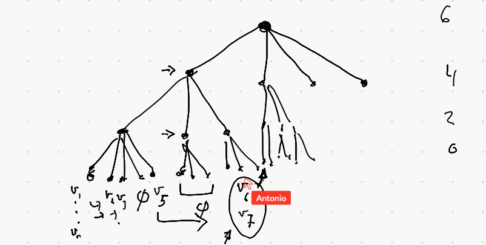
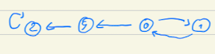

# Strategy improvement

## Nice idea of acceleration on progress measure. 
Antonio travail avec Pierre 

  

The idea is to accelerate when there is a hole in the tree. 
This prevents iterating in useless loops.
An example is 

  

Here strategy improvement will iterate long time increasing signatures of 0 and
1, before going to 9. 
The algorithm has not choice because it want to get the smallest signature. 

Zielonka algorithm will be much faster here:
In the first decent it will mark 9 loosing, and detect 2 winning. 
Then it will convert 9 to winning and mark the rest as winning in two steps:
first 0 and then 1.

Q: How it translates in the context of fixpoint computation.

#Antonio