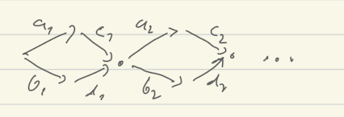
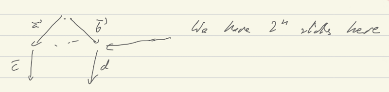

# Stubborn sets

-Form Stubborn Set Intuition Explained, [valmari-stubborn-intuition.pdf]
#partial-order

The setting is Petri nets. 

### Def $\to_M$ relation, and $G_M$
Take a marking $M$ and define $t \to_M t'$ for two transitions t, t'

- (PNe) If $t$ enabled in $M$ 
    

- (PNd) If $t$ not enabled in $M$ then we choose some place $p_t$ not enabling
  $t$ and 
	  

This relation depends on the choice of places $p_t$ for each transition $t$ not
enabled in $M$.
So the graph $G_M$ is not defined uniquely.

Apparently there are more refined conditions than (PNe) and (PNd) but they are
very complicated.

**Def** $Stub(M)$ is any set has some outgoing action ad that is successor closed in some graph
$G_M$. 

The intuition is that those transitions that are not in stubborn set do not
influence those that are in. 

**THM:** Every deadlock is reachable by a sequence of stub transitions.

**Proof**
This is consequence of two properties
- If $M\act{t}$ and $M\act{t_1\dots t_n} M'$ then $M'\act{t}$. 
  (follows form PNe)
- If $M\act{t_1\dots t_n} M'\act{t} M''$ then $M\act{t,t_1\dots t_n} M''$.
  (follows from PNd)

### How to find Stubborn sets?
Just construct $G_M$ and take some minimal one. 
There is a problem though as $G_M$ depends on choice of places and minimal one
is not unique

## Interesting example
  

There is a small exploration graph
  

But there is also a big one
  

This is not an example that we see with DPOR, as here we have two transitions
outgoing from the same node.

## Some conclusions from examples
There is no good heuristics to choose stubborn sets: 
- choosing a set with the smallest number of transitions may be bad. 
- favoring a set singleton set may be bad too.

There is a fundamental problem of comparing different methods as each method is
non-deterministic, so the result is not unique and can vary a lot.

# Comparing with Ample and Persistent

Stubborn are better than ample and the same as persistent.

There is a definition of weak stubborn that is enough for deadlocks and is even
better than persistent.

### Ample Set
C1: If $s\act{t_1\dots t_n} s'$ and $\set{t_1,\dots,t_n}\cap ample(s)=$ then
for all $i$, $t_i I ample(s)$.

### Stubborn set

D1: If $t\in stub(s)$,  $\set{t_1,\dots,t_n}\not\in stub(s)$, and  $s\act{t_1\dots t_n,t}s'$ then $s\act{t,t_1\dots t_n}s'$.

D2: $t\in stub(s)$,  $\set{t_1,\dots,t_n}\not\in stub(s)$, and  $s\act{t_1\dots
t_n}$ and $s\act{t}$ then  $s\act{t_1\dots t_n,t}$.

So the two are essentially the sam things modulo definition of independence that
stubborn sets do not require.

## Persistent sets
They are similar to Ample but use independence in a state, not a global
independence.
These are equivalent to stubborn sets

## Weak stubborn sets
D2w if $en(s)\not=\es$ then there is $t\in stubb(s)$ such that whenever
$s\act{t_1\dots t_n}s'$ and $t_1,\dots,t_n\not\in stubb(s)$ then $s\act{t_1\dots
t_n}s'\act{t}$.

It looks like weak stubborn sets preserve deadlocks too. 