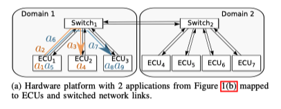

# Thiagu

They consider models with many processes: about 40 
It is more interesting to consider message passing with bounded delay for
messages than synchronous systems.

  

Question:
Can we say something anyway even if the model is much too big?
	* Bounded MC would be very fine
	* Statistical model checking.

What kind of properties:
Check if scheduler meets deadlines: no conflict, missing deadlines. 

Possible direction:
Sateless exploration timed models because models are too big. We need partial
order not to get an exponential number of executions. We bound the depth of
exploration. We can start with ample sets, but we will quickly need sleep sets,
or optimal methods of Parosh. 

A model with message passing with a bound on the time of sending messages.

## Main problem
When we have bounded time difference between processes then it is difficult to
do POR, as we loose diamonds. 
We should have some other notion that has bounded time difference and diamonds
at the same time. 

#real-time
