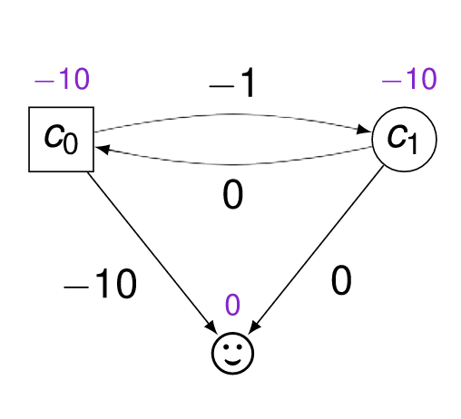
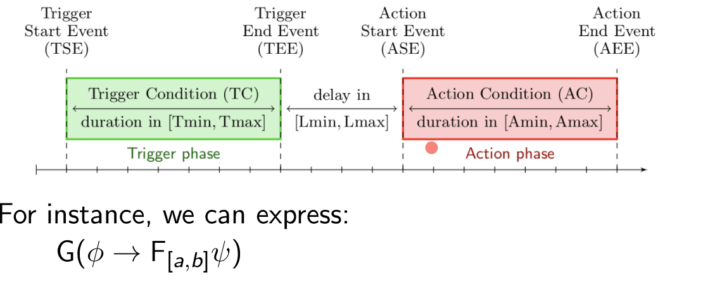

# TikTak meeting 2022

#seminar 2022-03-04
#real-time

## Playing stochastically in Weighted Timed Games to Emulate Memory
Julie Parreaux
Weighted games:
-each player chooses an edge and a delay, every node belongs to one of the
players.
- there are weights on edges and in states

Min needs memory. 
  

Player round should pass 10 times to the left but it should also go down at some
point because otherwise she cannot reach the target.

They study deterministic, finite memory, and all strategies are the same.
**In particular they use randomization to emulate memory.**
Q: what if there are no weights in states?

## Akshay Zones for reachability in Pushdown Timed Automata
[CAV'21]
Model introduced in [BER94]. One pushdown stack
They do not have age of a letter on the stack in the stack
All works use regions. Why they do not use zones?

Problem: well-nested control-state reachablity (stack empty at the end)

First he considers an obvious reachability algorithm where he has reachablity
from (q,Z) to (q',Z') with empty stack. 
The problem is that these rules may not be terminated if he does not use
subsumption.

There is a problem when using simulation on root nodes (soundness is lost)
They need to have equivalence of a_LU(Z) images instead of just subsumption.
This restores soundness and is still complete.

Q: DFS vs BFS?

## Open Problem:
1. can they handle ages on stacks?
2. Can we use similar approach to our liveness algorithm? We do not use a_LU equivalence.

Why not to start with the zone graph with symbolic push notation on edges, and
then try to deduce something on it.

# Timed network congestion games
Aline Goeminne
Players share resources: edges or locations of the network.
Costs on edges are like 2x "if x people take this edge, the price is 2x"
Non-blind strategies (depend on what other players do)
Only one clock, but there are n players.
There is a cost function in every node (depending on how many players are in the
node). It depends also on time spent in each location.
Only discrete time 

# Frederic Herbreteau

# Ocan Repairing Real-Time Requirements
 Trigger -> Action 
 Trigger phase has a fixed duration then there is an action time duration
  

He wants to test:
- non-vacuous R\in Req is requirement, it is OK if there is a trace that triggers
  R and satisfies all the requirements in Req
- rt-consistent all finite executions satisfying the requirements can be
  prolonged to an infinite execution satisfying the requirement

>> Open Question: Are Trigger-Action things bounded spread?

# Nicolas M??

