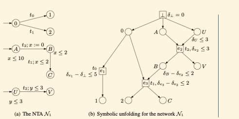

# Unfolding Cassez

[Papers/Cassez...]
This is similar to Boyer’s approach but they say more how to compute successors. 

They do not have places for clocks but assume that every process has its private
set of clocks. 
They assign to each event e a variable \delta_e that says at which moment the
event has been executed.  
They they assign a constraint on \delta_e for every e. 

The idea is that a set of events is feasible if it forms a configuration and the
the set of associated constraints is satisfiable. The constraints may not be
easy to deduce. In the example below \d_{e_1}-\d_\bot\leq 5 is deduced
indirectly because of invariants as t_1 needs to be executed in at most 5 time
units.


  

In the untimed case, one can detect if an event is fireable only by looking at
the past of the event. In the timed case this is not possible. In the example
above we have configuration e1, e2, the constraint for this configuration to
correspond to an execution is that d1-d2\leq 2. This constraint cannot be
deduced from individual constraints on e1 and e2, because e1 and e2 to do not
have common causal past. So a constraint associated to e1 must also refer to
variables that are not local variables of e1. 

Some notation:
We have places and events
A configuration is downward closed set of events that is conflict free.
A cut associated to a configuration is a set of places just above the configuration.

They construct untimed unfolding of a NTA, and then decorate it with constraints. 	
They have a variable $\d_e$ for every event $e$, and then try to deduce the constraints on these variables by looking at the constraints of timed automaton. 

Given a complete co-set (global configuration) it is possible to decide if a transition is enabled. 
One would like to have something like this but only by looking at the top dependent places. 
In general this is not possible. They add read arcs so the set of dependent places gets bigger and makes this possible. They do not say much about how to find these new places with read arcs. 
In the long version there is something about it but it looks brutal

They stay explicitly that they are not after an efficient method of constructing the unfolding. 

Compared to Bouyer, they are more ambitious as they define an unfolding and then a general constraints on how to add read arcs. Bouyer just gives a method to add read arcs. For her it is easier because she has places for clocks. The method of Bouyer is also cleaner that way. 

#real-time
#partial-order