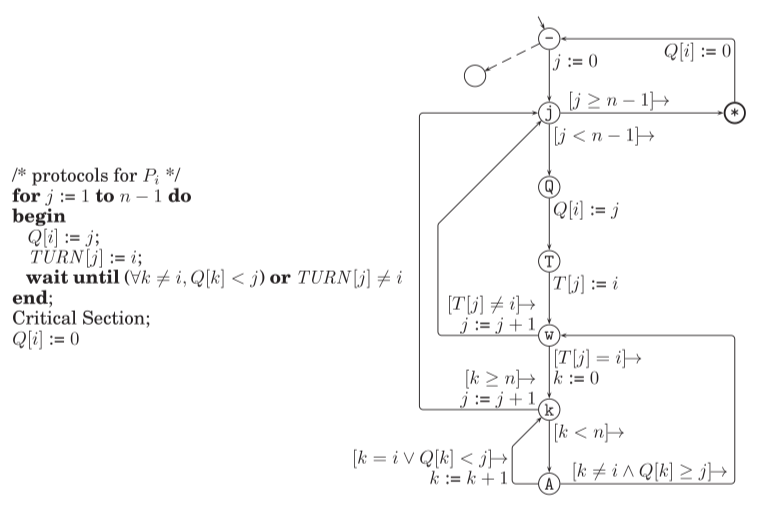

# Verification of token systems

Apply our results to verification problems. 
To check if a given system with 2 tokens does not have a deadlock it suffices to
calculate patterns for every process and then check for an existence of a
deadlock scheme for the patterns.
This may be much more efficient than direct model checking, even with
partial-order, even with SAT.
The same applies to systems with nested tokens
Moreover we can try to do parametric model-checking
- [ ] Complexity of verification for 2 tokens (non-exclusive case)
- [ ] Parametric verification for 2 tokens 
  - [ ] How to specify such systems
  - [ ] Can we get decidability results of good complexity
- [ ] Complexity for verification with nested tokens (fixed number of tokens)
- [ ] Parametric verification for nested tokens
[[token-systems-parametrized]] look as close relative, but the proof methods
seem not applicable for us. 
[[guarded-protocols-parametrized]] are closer as guards can model locks. There
are some decidability results there. 

## Approximating with nested tokens
Can we approximate any token usage with nested tokens?
Maybe just for bounded preemption systems?

## Paterson is nested token?
  

No it is probably not

#corto
#parametrized
