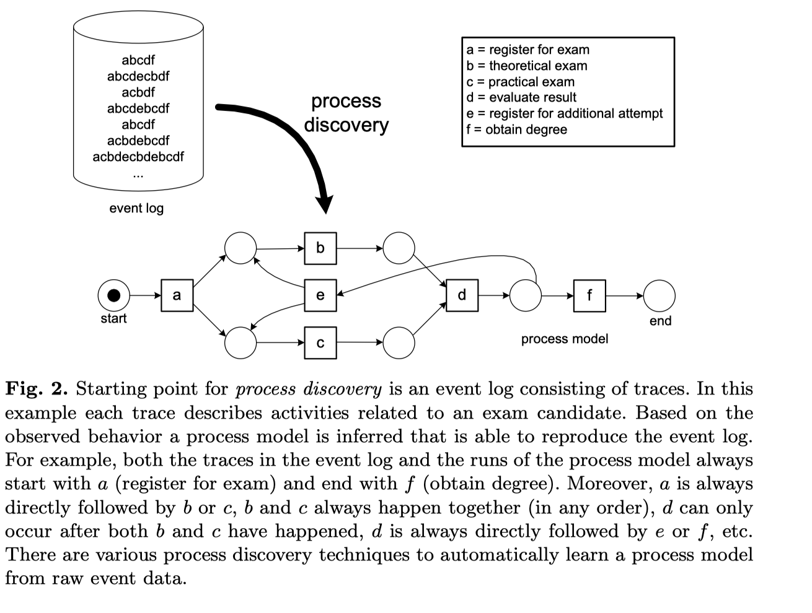
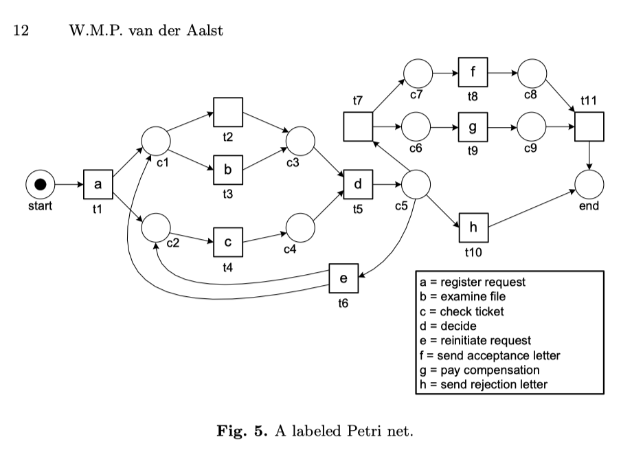

# workflow nets 

[The Application of Petri Nets to Workflow Management, Aalst]
[aalst-workflow-98.pdf]
Workflow net is a net with one initial place p_in  and one final place p_out
satisfying three requirements:
1. p_in has no input transition, p_out has no output transition
2. For every place or transition x, there is a directed path from p_in to x, and
   from x to p_out

Workflow net is *sound* if 
* it does not have dead transitions, and 
* from every marking  M reachable from {p_in}, the marking {p_out} is reachable from $M$.

The following two results say that sound deterministic negotiations are
essentially sound free-choice WF.

Prop [Desel, Esparza]: A net associated to a deterministic negotiation is sound
iff it is equivalent to a sound workflow net.

Thm [Desel, Esparza]: Every sound free-choice WF net is equivalent to a sound deterministic negotiation. 
[esparza-negotiations-to-pn.pdf]

Book with basic definitions
[esparza-free-choice.pdf]

Here free choice is: every pair of places have no common outgoing transitions,
or all outgoing transitions are common. 

Examples of Workflow nets
  

  
